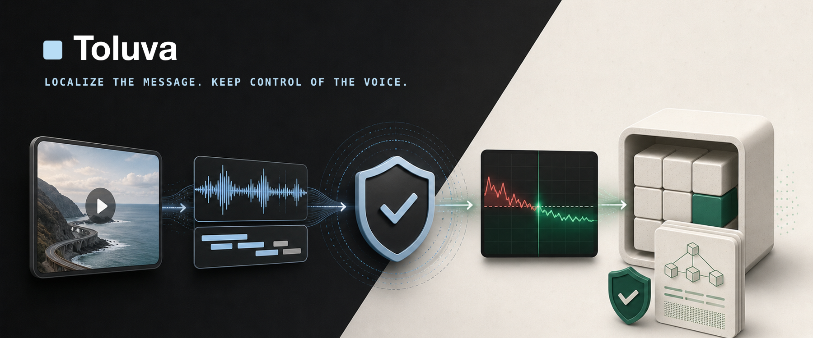
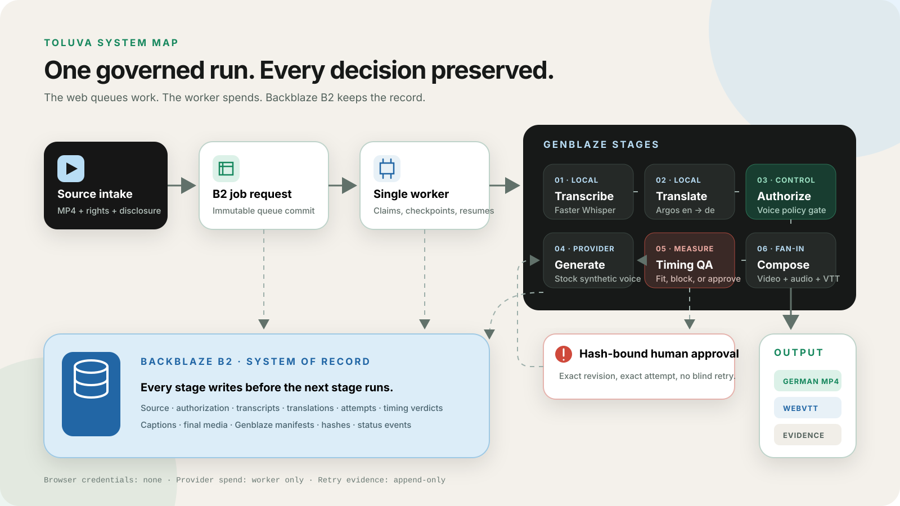

<p align="center">
  
</p>

# Toluva — Governed Video Localization with Voice Authorization, Timing QA, and Verifiable Lineage

> Toluva turns one approved source video into a time-aligned, consent-aware,
> verifiable localized edition.

**Localize the message without losing control of the voice.**

Built for the
[Backblaze Generative Media Challenge](https://backblaze-generative-media.devpost.com/).
The submitted product proves one complete English-to-German lane for internal
training media.

---

## Live

- 🎬 **Product walkthrough** — <https://youtu.be/UvJxSqS4j3Y>
- 🌐 **Live product** — <https://usetoluva.xyz>
- ➕ **Start a localization** — <https://usetoluva.xyz/workspace/new>
- 📖 **Documentation** — <https://usetoluva.xyz/docs>
- 🗺️ **Interactive architecture** — <https://usetoluva.xyz/docs/architecture>

---

## Table of Contents

- [Quick Path](#quick-path)
- [Why It Stands Out](#why-it-stands-out)
- [What It Does](#what-it-does)
- [Verified Production Run](#verified-production-run)
- [Architecture](#architecture)
- [Requirements](#requirements)
- [Setup](#setup)
- [Usage](#usage)
- [Product Boundaries](#product-boundaries)
- [Project Layout](#project-layout)
- [AI Assistance](#ai-assistance)
- [License](#license)

---

## Quick Path

```bash
git clone https://github.com/Pavilion-devs/toluva-backblaze.git
cd toluva-backblaze
npm install
npm run dev
```

Open <http://localhost:3000>. The product can render its completed reference
project without credentials. A fresh live localization additionally needs the
private B2/ElevenLabs environment and the single worker described below.

---

## Why It Stands Out

- **Voice authorization is an active control.** Toluva checks the stored
  language, purpose, validity window, revocation state, voice type, and evidence
  hash before a provider call. A mismatched request is blocked without spending
  speech credits.
- **Timing drift is measurable QA.** Every translated segment is compared with
  its original time slot. Overlong speech is revised or explicitly approved;
  short speech is padded without stretching the voice; retry history stays
  inspectable.
- **Backblaze B2 is the system of record.** Source media, approvals,
  transcripts, translations, every speech attempt, captions, timing verdicts,
  status events, final media, and canonical manifests live together as one
  durable lifecycle.
- **Genblaze is intrinsic to the pipeline.** Transcription, translation,
  speech, audio assembly, and final composition are separate, visible runs
  with fan-in, stored hashes, and parent/child lineage.

```text
source → durable B2 job → transcribe → translate → authorize
                                                   │
                                      allowed ─────┘
                                                   ↓
                                            generate speech
                                                   ↓
                                     measure timing drift
                                      ↙                    ↘
                         approved revision              compose
                                      ↖                    ↓
                                            B2 evidence + output
```

---

## What It Does

1. Accepts a short English MP4 after the uploader confirms source rights and
   the disclosed stock-synthetic voice policy.
2. Writes the source, source hash, admission slot, provider budget, and
   immutable queue request to Backblaze B2.
3. Uses pinned local Faster Whisper and Argos Translate stages to preserve
   timed segments and the protected term `Toluva`.
4. Checks the B2 voice-authorization record before ElevenLabs can be called.
5. Generates speech per segment through Genblaze and measures the real audio
   duration against the original slot.
6. Stops at a review gate when exact wording or a narrowly bounded local tempo
   fit needs human approval; the same job resumes from its stored checkpoint.
7. Fans the source video, localized audio master, and WebVTT captions into an
   H.264/AAC/`mov_text` German MP4.
8. Stores the final media, caption sidecar, disclosure, hashes, stage records,
   and Genblaze manifests back in B2.

The web application never receives B2 or provider credentials, and a page load
never regenerates media.

---

## Verified Production Run

The featured result is a real entrant-uploaded run, not seeded product data or
a paper mockup.

| Proof point | Verified result |
|---|---|
| Source | 11.989-second MP4 · 729,643 bytes |
| Lane | English → German · internal training · disclosed stock voice |
| Segmentation | 2 sentence-aligned source slots after immutable transcript correction |
| Speech generation | 4 ElevenLabs calls · 310 generated characters |
| Timing correction | Segment 2 attempt 2 measured +8.8777359% over its slot |
| Approved fit | Exact hash-bound `1.0887773589×` local fit under a `1.09×` ceiling; the normal ceiling remains `1.08×` |
| Orchestration | 9 Genblaze manifests across transcription, translation, speech, assembly, and composition |
| Final media | 807,176-byte MP4 · 11.989 seconds · H.264 video · AAC audio · embedded German captions |

Final MP4 SHA-256:
`57a9b839ff39b1bcf843b223cc2d4ca08f1611ce81302fd22e6514aa4986fd93`

WebVTT SHA-256:
`fc8d07ab10a27511c12bd0dc7eaf474e894d4f7bc4e4c20109eeef509aeca2aa`

The result can be replayed from B2 without repeating Whisper, Argos,
ElevenLabs, or FFmpeg work.

---

## Architecture

<p align="center">
  
</p>

The hosted web app queues bounded work and renders durable records. One isolated
VPS worker owns provider spend and long-running media stages. Backblaze B2 is
the shared storage spine between them, so either process can recover without
turning browser state into the source of truth.

- **Live architecture:** <https://usetoluva.xyz/docs/architecture>
- **Pipeline details:** [`services/pipeline/README.md`](services/pipeline/README.md)
- **Worker isolation contract:** [`deploy/vps/README.md`](deploy/vps/README.md)

---

## Requirements

- Node.js 22.13 or newer
- Python 3.12
- [`uv`](https://docs.astral.sh/uv/)
- FFmpeg and FFprobe
- A bucket-scoped Backblaze B2 application key for live records
- An ElevenLabs API key for live German speech generation

The JavaScript and Python dependencies are locked in `package-lock.json` and
`services/pipeline/uv.lock`.

---

## Setup

### 1. Web application

```bash
npm install
npm run dev
```

### 2. Private environment

```bash
cp .env.example .env.local
```

Fill only the credentials needed for your environment. Keep B2 keys
bucket-scoped, never expose them through `NEXT_PUBLIC_*`, and never commit
`.env.local`.

Live intake fails closed by default. Enable `TOLUVA_ENABLE_LIVE_INTAKE` only
when the matching web and worker revisions are deployed. The default public
contract allows three admission slots per UTC day and enforces at most four
speech calls and 400 generated characters per job.

### 3. Pipeline environment

```bash
UV_CACHE_DIR=.uv-cache uv sync --project services/pipeline
```

Pinned Whisper and Argos model installation is documented in
[`services/pipeline/README.md`](services/pipeline/README.md#bootstrap). Model
weights and work products stay outside Git.

### 4. Verify the checkout

```bash
npm run lint
npm run build
node --test tests/rendered-html.test.mjs tests/job-contract.test.mjs
services/pipeline/.venv/bin/python -m pytest services/pipeline
```

Ordinary automated tests mock external providers and do not spend credits.

---

## Usage

Run the product locally:

```bash
npm run dev
```

Useful routes:

- `/workspace/new` — upload, intake checks, rights, and disclosure
- `/workspace/runs` — durable queue state, checkpoints, and approvals
- `/workspace/editions` — source/localized comparison and downloads
- `/workspace/timing` — measured drift and correction lineage
- `/workspace/voice` — authorization policy tester
- `/workspace/assets` — job-scoped B2 object inventory
- `/workspace/provenance` — Genblaze manifests and hashes
- `/docs` — product and operator documentation

Run the zero-cost pipeline checks:

```bash
PYTHONPATH=services/pipeline/src \
  services/pipeline/.venv/bin/python -m toluva_pipeline.cli readiness

PYTHONPATH=services/pipeline/src \
  services/pipeline/.venv/bin/python -m toluva_pipeline.cli local-provenance
```

Process at most one queued live job only when billable provider use is
intentional:

```bash
PYTHONPATH=services/pipeline/src \
  services/pipeline/.venv/bin/python -m toluva_pipeline.cli \
  queue-worker --once --confirm-spend
```

The explicit flag is required because a fresh accepted job can call
ElevenLabs. Completed checkpoints are reused from B2.

---

## Product Boundaries

The submitted lane is deliberately narrow:

- one English speaker
- 1–30 second MP4
- up to 8 MB at hosted intake
- English → German (`de-DE`)
- internal-training purpose
- disclosed ElevenLabs stock synthetic voice
- human review before publication

Toluva does **not** claim universal language support, perfect lip sync,
automatic legal or regulatory compliance, or proof that every supplied fact is
true. A manifest proves recorded lineage and canonical integrity. The product
is evidence-ready, audit-friendly, and compliance-supporting—not a substitute
for human judgment.

---

## Project Layout

```text
app/
  (marketing)/       public product page
  (workspace)/       intake, runs, editions, and evidence
  (docs)/            product and architecture documentation
  api/                narrow server-only bridges
lib/                  B2 access, job contracts, policy, formatting
services/pipeline/
  src/                providers, domain gates, storage, worker
  tests/              deterministic pipeline coverage
deploy/vps/           isolated one-replica worker contract
docs/                 rights ledger and repository assets
tests/                rendered UI and API-boundary tests
```

Large ScreenStudio captures, HyperFrames caches, and rendered submission videos
are intentionally kept outside the source repository. The deployed product
walkthrough remains under `public/` because it is part of the application.

---

## AI Assistance

Toluva was developed with AI-assisted engineering using OpenAI Codex across
architecture, implementation, testing, documentation, interface work, and demo
post-production. The entrant made the product, policy, provider-spend, rights,
approval, evidence, and publication decisions; recorded the product footage
and final narration; and performed the final review.

The repository preserves its tests, pinned dependencies, media-rights ledger,
and verified hashes so those decisions remain inspectable. See
[`docs/MEDIA_AND_RIGHTS.md`](docs/MEDIA_AND_RIGHTS.md).

---

## License

Source code is available under the [MIT License](LICENSE). Media, model outputs,
hosted provider services, generated assets, and third-party dependencies remain
subject to their respective terms. See
[`THIRD_PARTY_NOTICES.md`](THIRD_PARTY_NOTICES.md) and
[`docs/MEDIA_AND_RIGHTS.md`](docs/MEDIA_AND_RIGHTS.md).
