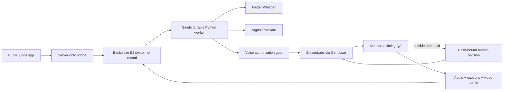

# Toluva

Toluva is a governed video-localization workflow for enterprise training and
communications teams.

> Toluva turns one approved source video into time-aligned, consent-aware,
> verifiable localized editions.

The submitted deployment proves one complete English-to-German production
lane. It does not claim universal language support, perfect lip sync, or
automatic legal compliance.

## Live judge experience

- Application: <https://toluva.asaborodaniel.chatgpt.site>
- Source: <https://github.com/Pavilion-devs/toluva-backblaze>
- Public mode is intentionally read-only. Judges can inspect the verified run,
  compare the source visual with the German edition, play both timing attempts,
  test an allowed or blocked voice-policy request, inspect B2 assets, and review
  Genblaze lineage.
- Anonymous visitors cannot create jobs, approve review records, mutate B2, or
  spend provider credits.
- The public English source preview is audio-free. The immutable engine source
  used a locally generated development voice and remains private B2 evidence;
  see [`docs/MEDIA_AND_RIGHTS.md`](docs/MEDIA_AND_RIGHTS.md).

## What is real

The featured controlled run is not seeded product data:

- 12.419-second English source processed into three timed segments
- Faster Whisper `base.en` transcription
- Argos Translate English-to-German model package `1.3`
- ElevenLabs Flash v2.5 stock synthetic speech
- Three actual TTS calls and 189 generated characters
- Two silence-padded segments and one measured `1.0448980952×` tempo fit
- H.264 video, AAC audio, embedded `mov_text` captions, and a WebVTT sidecar
- 60 job-scoped Backblaze B2 objects
- Nine Genblaze manifests: transcription, three translations, three speech
  runs, localized-audio fan-in, and final composition
- Final MP4 SHA-256:
  `369f3eea954c2bba91bd7a65cade78a86a9f9e1050cf915702e9a2da2e3917fe`

The interface also exposes a separate verified correction proof. An 8.126984s
German attempt overran a 3.8s source slot by 113.868%. A protected-term-safe,
human-approved shorter revision generated 3.575873s of speech and moved the
segment to −5.898% green drift. Both audio objects, manifests, hashes, and the
Genblaze parent/child run relationship remain inspectable.

## Why B2 and Genblaze are necessary

Backblaze B2 is the system of record, not a final-file dump. It stores source
masters, authorization evidence, transcripts, quality decisions, translations,
every speech attempt, captions, composition inputs, final renders, disclosure
records, status events, checkpoints, and canonical manifests.

Genblaze owns the visible generative-media orchestration. Toluva uses separate
providers and runs for transcription, translation, speech generation,
source-timed audio assembly, and three-input video composition. Every retry is
append-only and may carry parent/child lineage; the application independently
checks stored media hashes before describing bytes as verified.



## Provider and model inventory

| Stage | Provider | Model/version |
|---|---|---|
| Transcription | Toluva Genblaze `SyncProvider` + Faster Whisper | `Systran/faster-whisper-base.en` revision `88b03866…` |
| Translation | Toluva Genblaze `SyncProvider` + Argos Translate | `translate-en_de` package `1.3` |
| Speech | Genblaze ElevenLabs provider | `eleven_flash_v2_5` stock voice |
| Audio fan-in | Toluva Genblaze `SyncProvider` + FFmpeg | `ffmpeg-segment-audio-v2` |
| Composition | Toluva Genblaze `SyncProvider` + FFmpeg | `ffmpeg-captioned-mp4-v1` |
| Storage | Genblaze S3 sink + Backblaze Native API bridge | Backblaze B2 |

Pinned Genblaze packages are `genblaze-core==0.3.8`,
`genblaze-s3==0.3.6`, and `genblaze-elevenlabs==0.3.3`.

## Repository map

- `app/` — public judge interface and narrow server routes
- `lib/` — B2 bridge, verified-run loader, job contracts, and policy evaluation
- `services/pipeline/` — FastAPI/Genblaze pipeline, worker, providers, storage,
  domain policy, and tests
- `deploy/vps/` — isolated one-replica worker deployment contract
- `docs/` — SDK feedback, media/rights ledger, and submission notes
- `tests/` — rendered application and API boundary tests

## Local setup

Requirements:

- Node.js 22.13 or newer
- Python 3.12
- `uv`
- FFmpeg and FFprobe

```bash
npm install
npm run dev
```

The app works in verified-snapshot mode without credentials. To read live B2
records, copy `.env.example` to `.env.local` and provide a bucket-scoped key.
Never commit `.env.local`.

The public deployment must keep `TOLUVA_ENABLE_LIVE_INTAKE=false`. Enable live
intake only in a private operator environment after explicitly authorizing
provider spend.

## Pipeline setup and verification

```bash
UV_CACHE_DIR=.uv-cache uv sync --project services/pipeline
services/pipeline/.venv/bin/python -m pytest services/pipeline
npm run lint
npm run build
node --test tests/rendered-html.test.mjs
```

Ordinary automated tests mock external providers. Successful checkpoints are
reused from B2; page loads never regenerate media.

See [`services/pipeline/README.md`](services/pipeline/README.md) for pipeline
commands and [`deploy/vps/README.md`](deploy/vps/README.md) for the isolated
worker contract.

## Safety and integrity boundaries

- B2 and provider credentials never reach browser code.
- Public write routes fail closed before upload, approval, or provider spend.
- Media proxies accept fixed kinds or exact opaque job handles, never arbitrary
  B2 keys.
- Authorization evaluates language, purpose, validity, revocation, and the
  stored evidence hash before generation.
- A manifest proves recorded lineage and canonical integrity; it does not prove
  every supplied fact or guarantee regulatory compliance.
- Failed attempts and old stage records remain append-only evidence.

## License and media notices

Source code is available under the MIT License. Media, model outputs, provider
services, and third-party dependencies remain subject to their respective
terms. See [`LICENSE`](LICENSE),
[`THIRD_PARTY_NOTICES.md`](THIRD_PARTY_NOTICES.md), and
[`docs/MEDIA_AND_RIGHTS.md`](docs/MEDIA_AND_RIGHTS.md).
