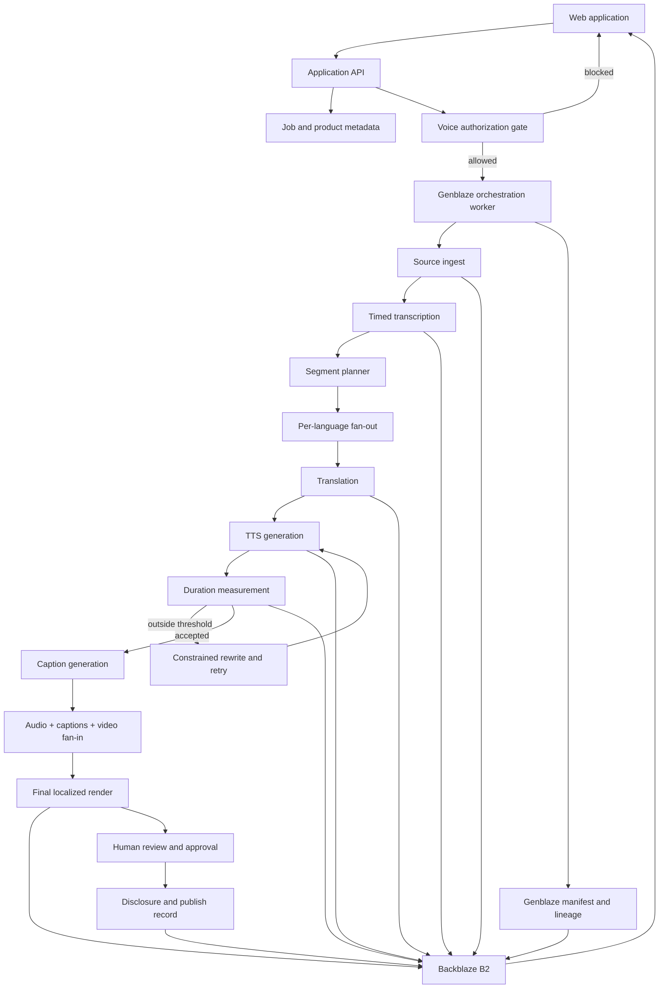

# Toluva — Product, Architecture, and Win Plan

Last updated: July 31, 2026
Status: controlled proof staged; B2 free-tier transaction reset pending
Submission deadline: August 3, 2026 at 10:00 p.m. WAT  
Internal submission target: August 3, 2026 at 6:00 p.m. WAT

## 1. Executive Summary

Toluva is a governed video-localization workflow for enterprise training and
communications teams.

It turns one approved source video into multiple localized editions while:

- Enforcing synthetic-voice authorization
- Measuring and correcting timing drift
- Preserving a complete generation and approval lineage
- Storing source, intermediate, and final assets durably in Backblaze B2
- Using Genblaze for meaningful multi-step generative-media orchestration

The product promise:

> One video. Multiple languages. Every voice authorized, every segment
> time-fit, and every output verifiable.

The short value statement:

> Localize the message without losing control of the voice.

## 2. Why This Can Win

### The audience explains itself

The initial benefit is immediately understandable:

> Turn one approved video into multiple language editions.

The primary audience is enterprise training and communications teams that reuse
videos featuring executives, instructors, brand representatives, or subject
matter experts.

Their practical problems include:

- Localization cost and turnaround time
- Translated speech no longer fitting the source timing
- Inconsistent terminology across regions
- Unclear authorization to clone or synthesize a speaker's voice
- No reliable record of who approved a generated edition
- Difficulty updating many language versions after the source changes
- Fragmented source files, intermediate files, captions, and final exports

### The pipeline complexity is intrinsic

The workflow genuinely needs multiple stages and modalities:

```text
ingest → transcribe → segment → translate → synthesize speech
       → measure → rewrite/retry → caption → compose → approve → publish
```

The composite stage naturally fans in the source video, localized audio,
captions, disclosure data, and other media. Genblaze features should arise from
the workflow rather than being added to satisfy a checklist.

### The B2 storage story is real

A single source produces:

- One source master
- Consent and policy records
- A transcript and timed segments
- Per-language translation revisions
- Multiple TTS attempts
- Caption files
- Audio stems
- Optional posters/thumbnails
- Final localized renders
- Provenance manifests
- Approval/disclosure records

This is a real media-asset lifecycle and a natural object-storage workload.

### The demo is immediately legible

The same clip played across languages is visually and audibly understandable.
The timing QA dashboard and consent-blocked generation create two memorable
product moments that do not require judges to understand the implementation.

## 3. Strategic Differentiation

Generic AI dubbing is a predictable hackathon category. Toluva must win through
domain-specific execution rather than pretending the category is novel.

The differentiation is not “we translate video.” It is:

1. Voice authorization is enforced before generation.
2. Timing fit is measured and corrected segment by segment.
3. Every attempt, decision, and output has inspectable lineage.
4. B2 is used as the durable system of record for the complete media lifecycle.

### Signature demo moment A: timing correction

A translated German segment is 24% longer than its source window. The segment is
red. Toluva requests a semantically equivalent shorter translation, regenerates
the speech, remeasures it, and turns the segment green while preserving the
protected term.

### Signature demo moment B: authorization enforcement

A user requests a Japanese cloned-voice edition, but the consent record covers
only French and Spanish. Toluva blocks the job, shows the exact policy mismatch,
and does not call the billable provider.

The final demo languages are not yet locked. These examples are provisional
until the provider spike verifies API access, voice quality, and language
support.

## 4. Judging Strategy

### Real-world utility

Evidence Toluva should present:

- A specific buyer/user: enterprise training and communications teams
- A concrete source-to-localized-output workflow
- Measurable timing-fit results
- Protected terminology
- Authorization enforcement
- A source-change/versioning story
- A credible reduction in manual coordination

Avoid vague claims about “revolutionizing content.”

### Production readiness

Evidence Toluva should present:

- Explicit job and segment states
- Bounded retries and provider fallback
- Idempotent job creation
- Refresh-safe progress
- Human approval
- Error recovery
- Cost awareness
- Consent validity checks
- Durable versions and audit history
- Stable hosted application and judge access

### B2 storage and data orchestration

Evidence Toluva should present:

- An inspectable asset tree for each project/run/language
- Source, intermediate, final, and manifest objects
- Durable media URLs or secure signed access
- Versioning and lineage
- Hash verification
- Metadata that connects UI records to B2 objects
- No “B2 only stores the final MP4” architecture

### Meaningful Genblaze usage

Evidence Toluva should present:

- A real multi-step pipeline
- Per-language fan-out
- Composite fan-in
- Provider abstraction
- Retry/fallback behavior
- Parent/child lineage for timing correction
- Object storage sink
- Provenance manifests and hashes

The architecture view in the application should make Genblaze's role
understandable without exposing code.

## 5. Synthetic-Voice Angle

### Product role

Provenance must be the product's spine, not a final verification tab.

Before generating a cloned voice, Toluva checks an authorization record:

- Speaker/rights holder
- Voice profile ID
- Voice type: stock, designed, or cloned
- Evidence object and SHA-256
- Permitted languages
- Permitted purposes
- Valid-from and expiry dates
- Revocation state
- Approver and approval timestamp

Example purposes:

- Internal training
- Public marketing
- Customer education
- Product documentation

A request outside this scope is blocked before any paid model call.

### Output disclosure

An applicable localized output should include:

- A clear visible or audible disclosure appropriate to the media
- A machine-readable sidecar or embedded manifest
- The generation provider and model
- Whether a cloned or synthetic stock voice was used
- The applicable consent-record reference
- A cryptographic hash for the output
- The approval state and approving user

### Regulatory context

Article 50 of the EU AI Act becomes applicable on August 2, 2026. It introduces
transparency obligations for certain AI-generated or manipulated content,
including machine-readable marking by applicable providers and disclosure for
certain deepfakes by deployers.

This timing strengthens the problem story, but Toluva must not claim automatic
or guaranteed legal compliance. The safe positioning is:

> Toluva provides an evidence-ready workflow that helps teams document voice
> authorization, generation lineage, integrity, and synthetic-content
> disclosure.

Legal applicability depends on the organization, content, role, deployment,
jurisdiction, exceptions, and the final implementation.

## 6. Timing-Drift QA

### Why it matters

Translations vary in spoken duration. An accurate translation can still create
a bad dub when speech overruns the speaker's visual turn or the next scene.

Timing fit is a domain-specific, objective QA signal:

```text
slot_seconds = source_end_seconds - source_start_seconds
drift_seconds = generated_seconds - slot_seconds
drift_ratio = drift_seconds / slot_seconds
```

### Initial thresholds

```text
GREEN  abs(drift_ratio) <= 0.08
AMBER  0.08 < abs(drift_ratio) <= 0.15
RED    abs(drift_ratio) > 0.15
```

These are product defaults, not universal localization standards. They must be
configurable and tested against the selected sample.

### Correction policy

For overlong speech:

1. Preserve the original meaning and required terminology.
2. Generate a first translation.
3. Generate TTS through the configured Genblaze provider.
4. Measure the returned media with a trusted media-inspection tool.
5. If over threshold, request a shorter translation with:
   - Current duration
   - Target duration
   - Protected terms
   - Meaning constraints
   - Retry number
6. Regenerate and remeasure.
7. Stop after the configured maximum attempts.
8. Permit only a small tempo correction inside an approved range.
9. Otherwise mark the segment “human review required.”

For speech that is too short:

- Prefer natural silence padding for small gaps.
- Optionally request a modest expansion when it improves meaning or flow.
- Avoid unnatural slowing.

### Initial safeguards

- Default maximum rewrite/TTS attempts: 2 after the first attempt.
- Default tempo adjustment limit: to be verified through listening tests; do not
  ship an untested value.
- Protected terms must remain exact or use an approved localized equivalent.
- Every attempt receives its own asset, measurement, status, and lineage.
- A retry must never overwrite the previous attempt in B2.
- The UI must explain why the selected attempt won.

### QA metrics shown in the product

- Source slot duration
- Generated speech duration
- Absolute drift in seconds
- Drift percentage
- Attempt count
- Rewrite reason
- Protected-term result
- Selected/final attempt
- Human approval state

## 7. Important Architecture Decision

Do not use ElevenLabs' one-call Dubbing API as Toluva's core workflow.

Although convenient, it would move transcription, translation, timing, voice,
and composition behind a single external API. That would:

- Hide the main product logic
- Prevent Toluva from owning the timing-correction loop
- Weaken the meaningful Genblaze orchestration story
- Reduce per-stage provenance and inspectability
- Make B2 intermediate-asset orchestration less compelling

Use lower-level capabilities so Toluva owns the workflow:

```text
Transcription
  → timed segmentation
  → translation
  → TTS
  → measured duration
  → bounded rewrite/regeneration
  → captions
  → composition
  → approval/disclosure
```

Genblaze should orchestrate the generative-media portions, store generated
assets through its B2/S3 sink, and preserve lineage/manifests. Where a step is
implemented outside Genblaze, document the reason and attach its inputs and
outputs to the same job/run model.

## 8. Proposed System Architecture



### Components

The exact framework will be chosen during scaffolding, but the responsibilities
are fixed:

- Web UI: upload, configuration, progress, QA timeline, comparison, provenance
- Application API: projects, authorizations, jobs, access, signed asset URLs
- Worker: long-running pipeline jobs, provider polling, retries, composition
- Metadata store: queryable product/job state
- Backblaze B2: durable object and manifest system of record
- Genblaze: generative-media orchestration, provider adapters, storage sink,
  lineage, and provenance
- Media tooling: duration inspection and final composition

Do not rely on an in-memory job queue for the hosted judging path.

## 9. Initial Domain Model

### Project

- `id`
- `name`
- `owner_id`
- `source_asset_id`
- `source_language`
- `created_at`
- `status`

### Speaker

- `id`
- `display_name`
- `voice_profile_id`
- `voice_type`

### VoiceAuthorization

- `id`
- `speaker_id`
- `evidence_asset_id`
- `evidence_sha256`
- `allowed_languages`
- `allowed_purposes`
- `valid_from`
- `expires_at`
- `revoked_at`
- `approved_by`
- `approved_at`

### LocalizationJob

- `id`
- `project_id`
- `target_language`
- `purpose`
- `authorization_id`
- `status`
- `provider`
- `model`
- `estimated_cost`
- `actual_cost`
- `genblaze_run_id`
- `created_at`
- `completed_at`

### Segment

- `id`
- `job_id`
- `source_index`
- `source_start_seconds`
- `source_end_seconds`
- `source_text`
- `protected_terms`
- `status`

### SegmentAttempt

- `id`
- `segment_id`
- `attempt_number`
- `translated_text`
- `audio_asset_id`
- `audio_duration_seconds`
- `drift_seconds`
- `drift_ratio`
- `decision`
- `parent_run_id`
- `genblaze_run_id`

### Asset

- `id`
- `project_id`
- `job_id`
- `segment_id`
- `kind`
- `b2_key`
- `mime_type`
- `size_bytes`
- `sha256`
- `genblaze_manifest_key`
- `created_at`

### Approval

- `id`
- `job_id`
- `status`
- `reviewer`
- `notes`
- `approved_at`

## 10. Proposed B2 Object Layout

Use opaque IDs for privacy and stable organization. A readable draft:

```text
projects/{project_id}/
  source/
    master/{asset_id}.{ext}
    transcript/{version}.json
    segments/{version}.json
  authorizations/
    {authorization_id}/evidence/{asset_id}.{ext}
    {authorization_id}/record.json
  jobs/{job_id}/
    {language}/
      translations/{segment_id}/attempt-{n}.json
      qa/transcript/{version}.json
      qa/transcript/{version}-human-review.json
      speech/{segment_id}/attempt-{n}.{ext}
      captions/{version}.vtt
      composition/intermediate/{asset_id}.{ext}
      final/{version}.mp4
      disclosure/{version}.json
      manifests/{run_id}.json
  thumbnails/{asset_id}.{ext}
```

Requirements:

- Never overwrite attempts.
- Connect every database asset row to one B2 object.
- Preserve SHA-256 values.
- Keep sensitive consent evidence private.
- Use signed, expiring access for protected media.
- Keep judge demo access simple without exposing the entire bucket.

## 11. TTS Facts and Cost Plan

Verified planning facts as of July 28–29, 2026:

- ElevenLabs states that API access is included on every plan, including Free.
- Free provides 10,000 shared credits.
- Starter is currently listed at $6/month with 30,000 credits and instant voice
  cloning.
- Creator is listed at $22/month with 121,000 credits; a promotional first-month
  discount was displayed at the time of planning.
- Multilingual v2 uses approximately one credit per generated character.
- Flash/Turbo API generation may use approximately 0.5–1 credit per character.
- The same credit pool is shared across ElevenLabs products.
- Free-tier Voice Library API access is restricted.
- The Genblaze v0.6.0 release includes timestamped ElevenLabs TTS compatibility
  improvements.

Working estimate:

- A three-minute source may contain roughly 2,300–2,700 characters.
- Five generated language tracks may require roughly 11,500–13,500 characters
  before retries.
- At one credit per character, a single complete run can exceed the free tier.
- At discounted Flash rates, one run may fit, but retries and other product usage
  make the free tier unsafe as the only plan.

Cost strategy:

1. Verify the exact API route and model on day one.
2. Use 15–30-second clips during development.
3. Cache immutable generated results in B2.
4. Mock providers in automated tests.
5. Use idempotency controls to avoid accidental duplicate billing.
6. Limit retries by segment and job.
7. Track approximate credit consumption.
8. Purchase only after the integration spike confirms the required voice,
   language, cloning, and timestamp features.
9. Reserve full multi-language generations for final QA and demo recording.

The paid-plan decision belongs in the Decision Log after the provider spike.

## 12. Language Strategy

The marketing phrase “one video, five languages” is attractive but must not
become an unsupported technical promise.

Before locking the demo languages, test:

- Provider and model support
- API access on the selected plan
- Voice availability through the API
- Pronunciation quality
- Timestamp behavior
- Generated duration
- Character/credit usage
- Retry quality
- Caption rendering

The final demo may mean either:

- Source English plus four localized outputs, or
- Five localized outputs in addition to the source.

Choose the interpretation only after the cost and quality spike. The demo script
must state it unambiguously.

Language selection principles:

- Include at least one expansion-prone language to demonstrate timing QA.
- Include languages with verified voice quality.
- Favor a smaller number of excellent completed outputs over five broken ones.
- Never advertise unsupported languages because they look globally impressive.

## 13. MVP User Journey

### Step 1: Open a project

The judge opens a preloaded, entrant-owned sample project. Optional upload is
available, but the sample guarantees an immediate experience.

### Step 2: Review voice authorization

The application shows:

- Speaker
- Voice type
- Approved languages
- Approved purpose
- Validity period
- Evidence hash

### Step 3: Configure localization

The user selects:

- Target languages
- Purpose
- Voice
- Protected terminology
- Timing tolerance

### Step 4: Run the pipeline

The application shows clear stages and per-language progress. It exposes
meaningful provider/run details in an inspector.

### Step 5: Inspect timing QA

A timeline shows source slots and generated durations. At least one seeded or
real segment demonstrates the retry loop.

### Step 6: Compare outputs

The user can play:

- Original
- First TTS attempt
- Corrected/final localized result

### Step 7: Approve and verify

The user sees:

- Authorization decision
- Provider and model
- Attempts and drift values
- B2-backed assets
- Manifest/hash verification
- Disclosure status
- Final approval

## 14. MVP Scope

### Must have

- [x] Stable hosted web application
- [ ] Preloaded judge-friendly sample
- [x] Source-video upload or ingest
- [x] B2 source storage
- [x] Timed transcription
- [x] Segmentation
- [x] Pre-TTS transcript confidence and trailing-fragment gate
- [x] Immutable, hash-bound transcript correction and same-job resume
- [x] Voice-authorization record
- [x] Pre-generation authorization gate
- [ ] Target-language selection
- [x] Protected terminology
- [x] Translation
- [x] Genblaze TTS generation
- [x] Actual duration measurement
- [x] Drift classification
- [x] Bounded rewrite/regeneration loop
- [x] Multi-segment correction and source-timed audio assembly contract
- [ ] Controlled multi-segment production run
- [x] Captions
- [x] Final media composition
- [x] B2 storage for intermediates and finals
- [x] Genblaze manifests/lineage
- [x] Job and segment status UI
- [x] Persistent one-replica worker lifecycle and readiness
- [x] Leased worker heartbeat and honest online/offline UI
- [x] Pinned non-root Linux worker image
- [x] Source/final playback comparison
- [x] Provenance/disclosure inspector
- [x] Human approval state
- [ ] Judge access without setup friction

### Should have

- [ ] Provider fallback for TTS
- [ ] Signed private-asset URLs
- [ ] Cost estimate and actual-use display
- [ ] Source-change/version story
- [ ] Downloadable disclosure/manifest bundle
- [ ] Search/filter across localized assets
- [ ] Thumbnail/poster generation if it strengthens the demo

### Explicitly out of scope until must-haves work

- [ ] Perfect lip sync
- [ ] Real-time dubbing
- [ ] General video editing
- [ ] Billing and subscriptions
- [ ] Native mobile apps
- [ ] Voice marketplace
- [ ] Complex team permissions
- [ ] Unlimited providers or languages

## 15. First Technical Spike

Complete before polishing the UI:

1. Install and pin the current Genblaze packages.
2. Create a small B2 test bucket and least-privilege application key.
3. Upload a short entrant-owned source clip.
4. Produce or load a timed transcript.
5. Run one translated TTS segment through the Genblaze ElevenLabs adapter.
6. Confirm the selected voice is available through the actual API plan.
7. Confirm target-language quality.
8. Confirm timestamped response behavior where needed.
9. Measure generated duration independently.
10. Store the asset and Genblaze manifest in B2.
11. Verify the asset hash and manifest.
12. Repeat with a constrained shorter translation.
13. Record actual credit usage.
14. Test one failure and retry path.

Exit criteria:

- One real segment completes end to end.
- B2 contains both TTS attempts and manifests.
- The drift calculation selects the better attempt.
- Cost and language feasibility are known.
- Any Genblaze SDK issue is documented for a useful feedback submission.

### Spike progress — July 29

Completed without provider credentials:

- Installed and pinned the current compatible PyPI packages:
  `genblaze-core==0.3.8`, `genblaze-s3==0.3.6`, and
  `genblaze-elevenlabs==0.3.3`.
- Confirmed Genblaze's current `PipelineResult` interface, manifest schema 1.5,
  strict manifest verification, ElevenLabs timestamp option, and Backblaze
  storage-sink interface.
- Verified `ffmpeg` and `ffprobe` are installed.
- Implemented the pre-generation authorization gate with tests for allowed,
  expired, revoked, wrong-language, wrong-purpose, wrong-voice, invalid
  evidence, and missing-authorization cases.
- Implemented timing measurement and bounded decisions with threshold-boundary
  tests.
- Implemented append-only B2 object keys and a scoped hierarchical Genblaze
  sink. Bucket-wide lifecycle mutation is explicitly disabled.
- Ran a zero-cost Genblaze pipeline against deterministic local audio, wrote a
  canonical manifest, verified the manifest, and independently matched the
  declared asset SHA-256 to the referenced file bytes.
- Added a FastAPI service boundary and secret-safe readiness endpoint.
- Locked the Python dependency graph and passed 74 service tests.

Live portion completed:

- Completed on July 29 with credentials stored only in the ignored local
  environment.
- Created a private, bucket-scoped Backblaze key with read/write access limited
  to the `projects/` prefix, S3 bucket listing enabled, and a 30-day expiry.
- Verified the B2 region and authenticated Genblaze storage preflight.
- Ran ElevenLabs Flash v2.5 through the Genblaze ElevenLabs adapter with a
  54-character German stock-voice sample and timestamped output.
- The first provider call generated audio but the Genblaze storage transfer
  rejected the project-local provider output path. The audio and a sanitized
  failure record were preserved in B2; no manifest was claimed for that failed
  run.
- Retried from Genblaze's accepted temporary path. The run completed, returned
  seven word timings, stored the audio and canonical manifest in B2, downloaded
  the stored audio, and matched its SHA-256.
- Independently measured 3.668753 seconds against a 4.0-second slot:
  `drift_ratio = -0.08281175`. Toluva correctly classified it amber and selected
  natural silence padding.
- B2 now contains seven current objects spanning authorization evidence,
  authorization record, failed attempt, failure record, successful audio,
  Genblaze manifest, and QA report.
- Across the failed transfer and successful retry, 108 characters were sent to
  ElevenLabs. Exact credit debit still needs confirmation from provider usage
  reporting before choosing a paid plan.
- Logged the transfer-allowlist behavior as a reproducible Genblaze feedback
  candidate in `docs/genblaze-feedback-allowed-output-root.md`.

Timing-correction loop completed:

- Implemented a provider-independent bounded engine for initial generation,
  objective measurement, constrained shortening or expansion, regeneration,
  silence padding, and human review after retry exhaustion.
- Protected terms are validated before the first provider call and after every
  rewrite. A failed rewrite cannot trigger another billable TTS request.
- Every translation, timing decision, failure, and summary uses a distinct
  append-only B2 key. A stable job/segment record blocks accidental reruns
  before the provider is called.
- Each TTS attempt is its own Genblaze run and manifest. The correction engine
  uses `Pipeline.from_result()` so attempt 2 carries attempt 1 as its
  `parent_run_id`.
- Ran a 133-character German attempt against a 3.8-second source slot. The
  generated duration was 8.126984 seconds: +113.868% drift, red.
- Applied the human-reviewed 54-character constrained rewrite and regenerated.
  The second duration was 3.575873 seconds: -5.898079% drift, green.
- Both audio objects matched their declared SHA-256 hashes. Both stored
  Genblaze manifests verified, and the second stored run retained the parent
  link.
- B2 contains nine job-scoped objects for the proof: two translations, two
  audio assets, two manifests, two timing reports, and one summary. The
  authorization evidence and record are stored separately under the project.
- The proof spent 187 ElevenLabs input characters across two explicit calls.
  Provider auto-retry was disabled to avoid ambiguous double billing.
- The rewrite was deliberately labelled `human-reviewed-scripted-spike`.
  Translation-provider integration remains a separate next step and the result
  is not misrepresented as an LLM rewrite.

Captioned composition completed:

- Added validated timed transcript/segment contracts and deterministic WebVTT
  generation, including overlap, duplicate-ID, and timestamp-boundary tests.
- Created a Toluva Genblaze `SyncProvider` that performs a genuine three-input
  fan-in over source video, selected localized audio, and captions.
- Reused the previously verified green ElevenLabs asset. No new provider call
  or model credit was required.
- Re-verified the selected audio bytes against its stored Genblaze manifest
  before composition.
- Generated a clearly labelled deterministic source/transcript fixture and
  stored the source MP4, timed transcript, and segment records in B2.
- Generated a WebVTT caption sidecar and embedded the same captions as a
  `mov_text` stream in the final MP4.
- Silence-padded the measured 0.224-second shortfall to the 3.8-second source
  slot without slowing or stretching the accepted speech.
- The final MP4 is exactly 3.8 seconds and contains H.264 video, AAC audio, and
  a subtitle stream.
- The final bytes matched SHA-256
  `7e3c40a3f685ab57427e6cfa86a32871764ac48b898c65e388769ea0e0d44cf4`.
  The stored composition manifest also verified.
- The timing job now contains 14 objects in B2; the project source tree contains
  three source/transcript objects. A disclosure record and sanitized final
  record link the complete output lineage without local filesystem paths.
- The fixture proves the ingest-record, caption, fan-in, composition, and final
  storage engine. It is not represented as live STT or the final licensed demo
  source.

Fixture-free English-to-German slice completed:

- Created and ingested a real speech-bearing four-second development MP4. The
  locally generated source is labelled as a development sample, not the final
  entrant-owned or licensed demo asset.
- Added an ElevenLabs Scribe v2 Genblaze provider, recorded a real HTTP 401
  authorization failure from the current TTS-scoped key, and blocked automatic
  replay through a durable B2 provider intent.
- Switched the verified transcription path to `faster-whisper==1.2.1` with
  `Systran/faster-whisper-base.en` pinned at revision
  `88b03866a4066bb4a97c12258abb82b1e9af0121`.
- Wrapped local Whisper in a Toluva Genblaze `SyncProvider`, stored its
  timestamped JSON output and canonical manifest in B2, and recorded the model
  revision and model-weights hash.
- Whisper transcribed: “Welcome to Toluva, One Message, Many Languages.” The
  product name was supplied as a recognition keyterm and preserved exactly.
- Added `argostranslate==1.11.0` with the English-to-German model package `1.3`
  behind a Toluva Genblaze `SyncProvider`.
- The live model translated the segment to “Willkommen bei Toluva, eine
  Botschaft, viele Sprachen.” and passed protected-term validation.
- Voice authorization passed before the one billable TTS call. ElevenLabs
  generated 54 characters and 3.529433 seconds of German speech for a
  4.0-second slot.
- Toluva measured -11.764175% timing drift, classified it amber, and selected
  natural silence padding without stretching the voice.
- Genblaze composed an exact 4.0-second H.264/AAC/`mov_text` MP4 from source
  video, selected German audio, and WebVTT captions.
- The completed job contains 16 job-scoped B2 objects. The transcription,
  translation, speech, and composition manifests all verify.
- The downloaded final B2 object matched SHA-256
  `611924ce72726f686ead5cc71ccd131bf85d0a58ba5518605ebccfdc9e52ef2b`.
- A replay of the completed job returned from B2 in approximately 1.3 seconds
  without calling Whisper, Argos, ElevenLabs, or FFmpeg again.

Hosted engine view completed:

- Replaced the fictional leadership-training dashboard records with the genuine
  `english-to-german-v4` B2 run.
- Added a server-only Backblaze Native API reader that validates bucket,
  `readFiles` capability, and the `projects/` key restriction before returning
  any data.
- Added an exact-project object allowlist and immutable-final-record resolution
  for source, localized MP4, captions, and speech media.
- Added range-capable private MP4 proxying. Local production-runtime checks
  returned HTTP 206 for both source and final video byte ranges and served the
  WebVTT sidecar.
- The hosted view now shows the real Whisper transcript, Argos translation,
  protected-term decision, German-only authorization scope, 3.529433-second
  speech duration, -11.764175% amber drift, silence-padding decision, 16
  job-scoped B2 objects, and four actual Genblaze manifests.
- Added a completed-job replay control that reloads the final B2 checkpoint
  without invoking Whisper, Argos, ElevenLabs, or FFmpeg.
- Added an honest `LIVE B2 RUN` versus `VERIFIED SNAPSHOT` state. Missing B2
  credentials fail closed and never expose a secret or invent a live response.

Durable upload and queue slice completed:

- Added a governed Sites-hosted MP4 intake for the first deliberately narrow
  lane: 1–8 second, single-turn English clips to German internal training using
  the disclosed stock synthetic voice and protected term `Toluva`.
- The server validates MIME type, 12 MB size limit, client-measured duration,
  target language, and purpose before writing. The browser never receives a B2
  or provider credential.
- A fresh request creates opaque project, job, and source IDs. It writes the
  source MP4, source record, immutable queue request, and initial status event
  beneath the `projects/` B2 prefix.
- Added a Python B2 queue consumer that validates the request handle, source
  key, size, and SHA-256 before claiming the job. The worker publishes
  append-only status events for queue, claim, source verification,
  transcription, translation, authorization, TTS, timing QA, composition, and
  completion.
- Parameterized the verified end-to-end engine to ingest a pre-existing
  uploaded source while preserving the old development proof defaults.
- Added refresh recovery using a browser-held opaque job pointer only. The job
  request, state, media, and final record remain authoritative in B2.
- Added a completed-job media bridge that resolves source, final MP4, captions,
  and speech only from the immutable final record and exact opaque job handle.
- Ran the real four-second English sample through the hosted-style upload route.
  B2 stored a 49,903-byte source and returned a durable queued state.
- The Python worker consumed that exact request and completed all 12 status
  stages. Whisper detected “Welcome to Toluva, One Message, Many Languages.”,
  Argos produced the verified German translation, ElevenLabs generated 54
  characters once, timing QA selected amber silence padding, and Genblaze
  produced the exact 4.0-second final MP4.
- The final asset SHA-256 remained
  `611924ce72726f686ead5cc71ccd131bf85d0a58ba5518605ebccfdc9e52ef2b`.
  The hosted-style proxy returned HTTP 206 for the new job's MP4 and
  `text/vtt` for its captions.
- Replaying the exact uploaded job returned the completed B2 checkpoint without
  Whisper, Argos, ElevenLabs, or FFmpeg output, confirming duplicate-spend
  protection.
- Added a continuous one-replica worker runtime with secret-safe readiness,
  leased B2 heartbeat, bounded polling backoff, signal handling, and stale-claim
  recovery from immutable B2 checkpoints.
- Added a pinned non-root Linux image containing the locked Python environment,
  explicit CPU-only PyTorch resolution, FFmpeg/FFprobe, Faster Whisper revision
  `88b03866a4066bb4a97c12258abb82b1e9af0121`, and Argos
  `translate-en_de` 1.3. The build verifies the exact model hashes before
  producing the deployment artifact.
- Verified the final `linux/amd64` image as UID/GID 10001 with OCI digest
  `sha256:41e238e088f63c0293667143c8ac8d2ba700ca9c105a6ae8558e4b3b18f620b8`
  and uncompressed size 1,628,957,753 bytes. Its secret-safe readiness returned
  true with both model hashes matching, FFmpeg/FFprobe present, PyTorch
  `2.13.0+cpu`, and CUDA unavailable.
- Ran Argos inside that exact Linux image without a network provider. It
  reproduced “Willkommen bei Toluva, eine Botschaft, viele Sprachen.”
- Added a server-only worker-status route and dashboard state. The interface
  shows a finite live lease as online/busy and otherwise says `QUEUE ONLY`.
- Published an actual idle heartbeat through the configured B2 path without
  invoking a provider. Its lease expired as designed when the operator-run
  process exited.
- Deployed the exact verified worker image as one isolated, always-on VPS
  container managed by systemd. It exposes no port and is capped at 1.5 CPUs,
  2,000 MB RAM, 256 processes, and three 25 MB log files.
- The deployed image ID matches
  `sha256:41e238e088f63c0293667143c8ac8d2ba700ca9c105a6ae8558e4b3b18f620b8`.
  It runs as UID/GID 10001 with all capabilities dropped and
  `no-new-privileges`.
- The root-only worker environment is mode `0600` and contains only the scoped
  B2 credential, ElevenLabs key, and fixed worker settings. The worker has no
  web, reverse-proxy, DNS, or inbound-firewall dependency.
- Remote readiness passed, the container reached `running healthy` with zero
  restarts, and settled idle consumption measured approximately 66 MB RAM and
  0.01% CPU.
- B2 reported a current `queue-v1`, one-replica, idle lease. The hosted
  dashboard independently rendered `WORKER ONLINE` and `LIVE B2 RUN`.
- The worker was started while the B2 queue was empty, preventing an unexpected
  provider call or inference burst during deployment.
- The VPS already hosted an unrelated Dara API and Cloudflare tunnel. Toluva
  did not edit their unit files, paths, ports, reverse proxy, DNS, or secrets.
  Their unit hashes remained unchanged, and their process IDs stayed unchanged
  throughout the actual Toluva service start and final health verification.
- Ubuntu's one-time Docker package installation did trigger a brief managed
  restart of those pre-existing services. They recovered healthy immediately.
  Additional orderly restarts occurred while separate Dara regeneration
  traffic was active; kernel logs showed no OOM. Future Toluva operations must
  not reinstall Docker, reboot the host, or touch those units.
- A later controlled production preflight exposed a B2 transaction-budget
  defect before any new TTS call: the five-second worker loop repeatedly
  inspected the durable queue and exhausted the configured Class B/download
  cap.
- Queue v2 now scans queued, claimed, failed, completed, and immutable-final
  state from one paginated listing snapshot with no per-job `HEAD` or `GET`
  requests during idle discovery. Immutable final records also act as terminal
  markers when a completion event is unavailable.
- Idle state transitions no longer publish a heartbeat object. Poll and
  heartbeat intervals are both at least 60 seconds, reducing background B2
  transaction volume while keeping the judge-facing lease finite.
- The queue-v2 implementation passed all 87 pipeline tests, secret-safe image
  readiness, and pinned Whisper/Argos model-hash verification. The interrupted
  handshake used no new ElevenLabs credits and will resume only after B2 reads
  are available.
- Deployed queue v2 as the pinned `linux/amd64` image
  `sha256:6c78a0ef5cedcd38b2a2165fd23c3632dc002a530c536006f38c4065f5c7e4c3`.
  The VPS image matched locally, the container reached `running healthy` with
  zero restarts, and all original resource, user, capability, and no-port
  controls remained active.
- Consecutive production ticks now show one idle scan per minute and no
  completed-job failure loop. The root-only environment remains mode `0600`.
  Both unrelated services were active and Dara's health endpoint was green
  after deployment.
- The Dara API process ID changed during the long model-image transfer even
  though no command targeted its unit or configuration; the Cloudflare tunnel
  process stayed unchanged and the kernel recorded no OOM. Avoid another
  model-image transfer on this shared host unless a worker-image change is
  submission-critical.

Controlled production handshake completed on July 30:

- Backblaze Class B and Class C caps had reset with sufficient headroom. No cap,
  billing, or lifecycle setting was changed.
- The first hosted intake attempt durably stored only its 49,903-byte source
  object, then stopped before a queue request existed. No worker claim or
  provider call occurred. The source remains preserved at
  `projects/intake-ea29e570c7224b7eb1cbf5d6998e1727/source/master/source-a8e286a9f4604d5883595d6b594a1198.mp4`.
- Added an immutable failure record beside that preserved namespace at
  `projects/intake-ea29e570c7224b7eb1cbf5d6998e1727/failures/hosted-intake-2026-07-30.json`.
  It records `queue_request_written=false`, `provider_called=false`, the exact
  source hash and size, and the fixing commit.
- Fixed intake publication in commit
  `22366132f24aeefcdb82aff073c8b65865534424`: one request-scoped B2 uploader
  now writes source, source record, and initial status before publishing the
  immutable queue request as the final commit marker.
- The deployed fix accepted the exact four-second source with SHA-256
  `f5872bd6324abd57d5c0a534c11729989a9e3a5f10384783dc49d8a98c6ad41e`
  and created project `intake-a41c94f7088544a08984b17070702388`, job
  `localize-f2c26c2ff9624974a9ca3d495b50654d`.
- Queue v2 claimed the job once and completed all 12 append-only status stages.
  Whisper and Argos ran locally; authorization passed before the only
  ElevenLabs attempt.
- ElevenLabs generated 61 characters and 3.94449 seconds of German speech.
  Drift was -1.38775%, inside the green threshold, so the first attempt was
  accepted with no rewrite and no second TTS call.
- The completed project contains 37 B2 objects, including exactly one speech
  manifest, one final record, four Genblaze manifests, the source lineage,
  captions, disclosure, timing records, and all 12 status events.
- The transcription, translation, speech, and composition manifests all
  verified, and every referenced asset matched its recorded SHA-256.
- The final B2 MP4 is 76,059 bytes, exactly 4.000 seconds, and contains H.264
  video, AAC audio, and German `mov_text` subtitles. Its SHA-256 is
  `98c7f2979d7521fe123d9ff01817a1b9105b0fae9bb31a86d11d79259d6419a6`.
  The authenticated hosted player reached ready state 4 and reported the same
  four-second duration; a browser-downloaded copy matched the B2 hash.
- An exact-handle replay returned the existing final checkpoint with
  `completed-job` in `resumed_completed_stages`. The project remained at 37
  objects, one speech manifest, and one final record; its newest object
  remained the original `12-completed` event. Worker logs showed no second
  ElevenLabs preflight or generation activity.
- The live source exposed a useful quality issue for the next phase: local
  Whisper appended “which is...” to the intended short sentence, and Argos
  translated that tail. The engine correctly preserved and disclosed what it
  detected, but judge-facing runs need a cleaner rights-cleared recording plus
  transcript-confidence and trailing-hallucination review before TTS.
- Added that review boundary as a deterministic engine stage. The exact
  production transcript now evaluates to `review_required` with reason
  `suspicious_trailing_fragment`, mean word confidence `0.690804`, and trailing
  evidence `Languages which is...`.
- The worker stores the policy, thresholds, reason codes, confidence evidence,
  provider-text hash, and detected text under the job's fixed B2 transcript-QA
  key. A review-required job becomes visibly `blocked` before Argos or
  ElevenLabs and is not recorded as a pipeline failure.
- The hosted workbench exposes only the sanitized evidence and accepts a
  corrected transcript through a server-only route. The correction is
  normalized, protected-term checked, hash-bound to the provider transcript,
  and stored separately as an immutable human-review record.
- That review record wakes the same job immediately, even while its original
  claim is fresh. The resumed worker reuses the transcription checkpoint and
  raw transcript, so review cannot create another STT call or erase evidence.
- Deployed the hosted transcript-review route and workbench in private Sites
  version 11. The new production release reported no recent worker errors.
- Deployed the source-identical engine as the isolated
  `toluva-worker:queue-v3-35465e6` image. It is healthy with zero restarts,
  preserved resource and security controls, and publishes a current
  `queue-v3`/one-replica/idle B2 lease.
- Ran the exact handshake transcript through the deployed image without B2 or
  provider access. It reproduced `review_required`,
  `suspicious_trailing_fragment`, mean confidence `0.6908042778571447`, and
  trailing evidence `Languages which is...`. The deployment created no job and
  made no Whisper, Argos, or ElevenLabs call.
- The first controlled queue-v3 proof stored a correct `review_required` QA
  record but then stopped safely because the freshly computed in-memory
  `reason_codes` value was a tuple while the replayed JSON value is a list.
  The integrity check correctly failed closed before translation or TTS, and
  the immutable failed job remains evidence of the defect. Normalize the fresh
  record to its JSON shape, cover the boundary with a regression test, then use
  a new job for the visible blocked-state proof rather than rewriting history.
- Commit `e3634e28cbf187c732ee9e936af0728dc1339132` implemented that JSON-shape
  normalization and raised the complete pipeline suite to 101 passing tests.
  The source-only fix image
  `sha256:f1e596beedd2477c81c1d7e872739c14df407e7d92e843f9d2b55d763cbba72d`
  passed offline readiness and the exact fresh-record regression before
  replacing only the Toluva service.
- The final controlled proof is project
  `intake-eae21f6090ae4ede90070ce422b91e0d`, job
  `localize-304ebb7c451e4db1b8000f7763d6ac60`. It ended at
  `06-transcript-blocked` with reason `suspicious_trailing_fragment`, mean word
  confidence `0.6908042778571447`, and trailing evidence
  `Languages which is...`.
- Its 16-object B2 namespace contains the source, request, transcription
  checkpoint and Genblaze evidence, timed transcript/segments, six status
  events, and transcript QA. It contains no translation, speech, captions,
  composition, disclosure, authorization, human review, or final output.
- The refreshed production UI rendered the complete pre-TTS review panel and
  its explicit `NO TTS SPEND` state. The correction/approval control remains
  untouched, so the job is durably blocked and cannot spend an ElevenLabs
  credit.

Controlled same-job transcript resume completed on July 30:

- Approved the exact correction “Welcome to Toluva, One Message, Many
  Languages.” through the production review panel for the same project
  `intake-eae21f6090ae4ede90070ce422b91e0d` and job
  `localize-304ebb7c451e4db1b8000f7763d6ac60`.
- B2 preserves the original provider transcript and its
  `suspicious_trailing_fragment` decision. A separate immutable human-review
  record contains the correction, and its original-text hash matches the
  transcript-QA record.
- The resumed final record reports `source-ingest`,
  `transcription-whisper-base-en`, `transcript-quality`, and
  `transcript-human-review` as reused checkpoints. The project still contains
  exactly one transcription manifest, proving Whisper was not repeated.
- Argos translated the reviewed source to “Willkommen bei Toluva, eine
  Botschaft, viele Sprachen.” The protected term remained exact.
- ElevenLabs generated 54 characters in exactly one explicit speech attempt.
  The 4.0-second slot measured -0.421224 seconds / -10.5306% drift, so Toluva
  classified it amber and padded silence instead of stretching the voice or
  requesting a second TTS call.
- The completed namespace contains 41 objects, 14 ordered status events,
  exactly one human-review record, one speech asset, one speech manifest, one
  immutable final record, and four Genblaze manifests across transcription,
  translation, speech, and composition.
- The final MP4 is 69,022 bytes and exactly 4.0 seconds. Its downloaded B2 bytes
  matched the recorded SHA-256
  `7eb71111fa8e3004f241865669624b32fad2886c68c8226fb3df831b852284c1`,
  and the production player reached ready state 4 with the same duration.
- Multiple subsequent queue ticks remained idle. A second B2 snapshot stayed at
  41 objects and one speech manifest, with `14-completed.json` still the newest
  object. This is the zero-spend replay proof for the human-review resume path.

Multi-segment engine contract completed locally on July 30:

- Added a provider-independent multi-segment localization engine that keeps
  every source segment, translation asset, speech attempt, timing decision, and
  selected result distinct. It no longer treats a transcript as one synthetic
  speech slot.
- Protected terms are enforced only on the segments that contain them. An
  unverified translation asset or manifest stops before the first TTS call.
- Segments run as bounded logical fan-out. Each uses the existing
  measure/rewrite/regenerate engine and its parent-run lineage. If one segment
  exhausts its retries, the job stops at human review before translating or
  synthesizing later segments.
- Added a Genblaze audio-assembly provider that places each accepted speech
  asset at its source start time, preserves natural gaps as silence, rejects
  collisions with the next segment, and produces an exact-source-length WAV
  master.
- The assembled master remains an explicit input to the existing
  video/audio/WebVTT composition provider. A deterministic three-segment proof
  produced video, audio, and embedded subtitle streams with independently
  verified Genblaze manifests.
- Added deterministic coverage for a three-segment run containing one green
  first attempt, one red-to-green rewrite with parent lineage, and one amber
  silence-padded result. Separate coverage proves human review prevents all
  later-segment provider calls.
- Added append-only B2 key contracts for the aggregate multi-segment summary and
  the generated localized-audio master. The aggregate summary is immutable and
  replayable.
- The complete pipeline suite now collects and passes 111 tests. This phase
  made no Backblaze write, no provider call, and no ElevenLabs credit spend.
  The production worker and hosted application remain on the proven
  single-segment release until a controlled multi-segment source and rewrite
  policy are approved.

Multi-segment production runtime wired and verified offline on July 30:

- Removed the live worker's transcript-collapse boundary. Whisper's provider
  segment IDs, start/end slots, and texts now remain distinct through
  translation, speech, timing QA, captions, audio assembly, composition, and
  the immutable final report.
- Added one checkpointed Argos Genblaze stage per segment. Protected terms are
  scoped only to segments that contain them, and every stored translation is
  re-verified against both its manifest and bytes before TTS.
- Replaced the non-rewriting live slice with an immutable B2-approved
  translation-memory boundary. A red segment writes the exact requested
  instruction and blocks before attempt 2 unless a hash-bound operator
  revision already exists.
- Added same-job timing resumption. The worker reloads completed attempts,
  verifies their stored speech and manifests, reconstructs the Genblaze parent
  result, and continues at the next attempt without repeating prior
  ElevenLabs calls.
- Added checkpointed Genblaze audio-master and final-composition stages. The
  selected segment speech is collision-checked against source timing, mixed
  into an exact-source-length WAV, and used as the explicit audio input to the
  existing video/audio/WebVTT fan-in.
- Extended the final record with per-segment translation, speech, timing,
  red-to-green, resume, aggregate-summary, and localized-audio lineage while
  keeping old immutable final records deserializable.
- Added a durable `timing-blocked` queue state. The current UI recognizes it as
  a separate timing gate instead of misreading it as a transcript failure.
- The full pipeline suite now collects and passes 119 tests, the Sites build
  passes, and this wiring phase made no Backblaze write, provider call, or
  ElevenLabs credit spend.

Queue-v4 production release completed on July 30:

- Deployed source revision `8e21b7e9c53bfa86d0d928944ccf431c9885d684`
  through the checked-in source-only Docker boundary. The main Dockerfile,
  `pyproject.toml`, and `uv.lock` were unchanged from the verified queue-v3
  base, so no dependency, model, media-tool, Python, or operating-system layer
  changed.
- The running image is `toluva-worker:queue-v4-8e21b7e`, image ID
  `sha256:0fac65bd5114ed41329266e4ddbb029593393cae49837cd2a7b9f2d70e3a4976`,
  size 1,629,192,452 bytes. Network-disabled imports and secret-safe readiness
  passed before cutover.
- The one Toluva container is active and healthy with zero restarts, no ports,
  1.5 CPUs, 2,000 MB RAM, 256 processes, root-only environment mode `0600`,
  and approximately 60 MB idle memory.
- The mutable B2 heartbeat reports `queue-v4`, one replica, `idle`, and a
  finite lease. No localization job, Whisper inference, Argos translation,
  FFmpeg composition, or ElevenLabs call ran during release.
- Sites version 12 deployed privately from commit
  `e26598277dc9718627b48d5e3df0fa252c0c7a02`. Recent production error logs
  were empty, and timing-blocked jobs now render the correct non-spend state.
- The Dara API, Dara web service, and both Cloudflare tunnel services retained
  their exact pre-cutover process IDs and unit hashes. Dara's health endpoint
  remained green.

Queue-v4 timing-approval release completed on July 30:

- Extended the governed production intake from 8 seconds to 30 seconds so the
  controlled proof can exercise genuine Whisper multi-segment output.
- Added a sanitized timing-review view and immutable approval endpoint to the
  hosted UI. The browser supplies only the opaque job handle and revised text;
  the server resolves the exact segment, attempt, request, and approval keys.
- Bound each approval to one request with a language-neutral SHA-256 contract
  shared by Python and TypeScript. The same Unicode German vector produced the
  same digest in both runtimes.
- Fixed repeated timing gates so every retry round has a unique append-only
  block and approval status. The B2 scanner resumes only when every stored
  revision request has its matching approval; approval for attempt 2 cannot
  unlock attempt 3.
- The full pipeline suite now passes 121 tests. UI lint, the Vinext production
  build, and all nine rendered route tests pass. This phase created no
  localization job and made no model, media, or ElevenLabs call.
- Deployed image `toluva-worker:queue-v4-c8d95e1`, image ID
  `sha256:e747d4810b40758ee0d07e72b20a52d65c433f65103eaaf192e2b34e37d780e3`,
  from source commit `c8d95e1a21a89b209b69e51ccc2d3905aef00ef7`.
  The container is active, healthy, idle, and still enforces the original
  one-replica, no-port, 1.5-CPU, 2,000-MB, 256-process boundary.
- Sites version 13 is privately deployed from the same commit; production
  error logs are empty.
- The Dara API, Dara web service, and both Cloudflare services retained their
  exact pre-cutover process IDs and unit hashes.

## 16. Delivery Schedule

### July 29 — Lock and spike

- Finalize product documents
- Scaffold the application
- Choose frameworks and deployment target
- Verify Genblaze, B2, transcription, translation, TTS, and media tooling
- Complete one end-to-end segment
- Decide TTS plan and initial demo languages

### July 30 — End-to-end vertical slice

- Persist project/job/asset records
- Implement authorization gate
- Implement per-language pipeline
- Implement timing measurement and bounded retry
- Generate captions
- Compose one complete localized video

### July 31 — Product experience

- Build upload/sample journey
- Build job progress and segment timeline
- Build drift comparison
- Build authorization and provenance inspectors
- Add source/final playback
- Improve errors and refresh recovery

### August 1 — Reliability and deployment

- Deploy the public app
- Add or verify persistent worker/job execution
- Test B2 permissions and signed access
- Add fallback/error states
- Run clean-browser and clean-environment tests
- Freeze dependency versions

### August 2 — Submission assets

- Complete final multi-language sample
- Record the demo video
- Capture screenshots
- Finish README and architecture explanation
- Draft Devpost submission
- File high-quality Genblaze feedback
- Remove unlicensed or unsafe assets

### August 3 — Buffer and submit

- Fix only submission-blocking defects
- Verify hosted app and all links
- Verify judge instructions
- Verify repository access/setup
- Submit by 6:00 p.m. WAT
- Preserve remaining time for emergency correction only

## 17. Three-Minute Demo Storyboard

Target runtime: 2:40–2:55.

### 0:00–0:15 — Problem

“Companies can translate a script quickly, but safely publishing an executive's
synthetic voice in multiple languages requires authorization, timing control,
and a reliable audit trail.”

### 0:15–0:35 — Product promise

Open the prepared project. Show the approved source, voice authorization,
languages, purpose, and protected terminology.

### 0:35–0:55 — Authorization block

Select an unauthorized language or purpose. Show Toluva block the job before
generation. Correct the selection.

### 0:55–1:30 — Pipeline

Start or replay the prepared run. Show Genblaze stages, per-language fan-out,
B2-backed assets, and progress.

### 1:30–2:00 — Timing correction

Open the red overlong segment. Compare first and corrected translations, play
both audio attempts, and show the measured drift turn green.

### 2:00–2:25 — Final output

Play short portions of the source and localized editions.

### 2:25–2:45 — Provenance and storage

Show consent reference, provider/model, parent/child attempts, B2 asset tree,
manifest, SHA-256 verification, and disclosure state.

### 2:45–2:55 — Close

“Toluva localizes the message without losing control of the voice.”

Avoid:

- Long team introductions
- Code walkthroughs
- Waiting on real generation
- Reading architecture slides
- Claims of guaranteed legal compliance
- More than ten seconds of dead loading time

## 18. Submission Checklist

### Application

- [ ] Public URL works in an incognito browser
- [ ] No authentication, or a tested judge account with clear instructions
- [ ] Sample project loads immediately
- [ ] Media plays without private-cookie dependencies
- [ ] No secrets reach the browser
- [ ] Job state survives refresh
- [ ] App remains hosted through August 11

### Repository

- [ ] All necessary source code is present
- [ ] README explains setup from a clean environment
- [ ] Architecture diagram is included
- [ ] Exact providers and models are listed
- [ ] Genblaze usage is explicit
- [ ] B2 usage is explicit
- [ ] Environment variables are documented without values
- [ ] Licenses and attributions are correct
- [ ] Private repo, if used, grants the required Backblaze review account access

### Demo video

- [ ] Under three minutes
- [ ] Publicly visible on YouTube, Vimeo, or Youku
- [ ] Shows the functioning application
- [ ] Includes authorization block
- [ ] Includes timing correction
- [ ] Includes localized output
- [ ] Includes Genblaze and B2 evidence
- [ ] Uses only entrant-owned or licensed media/music/trademarks
- [ ] Captions are readable

### Devpost text

- [ ] Defines the audience and problem immediately
- [ ] Explains the two differentiators
- [ ] Maps features to all four judging criteria
- [ ] Lists providers and exact models
- [ ] Describes B2 object/data orchestration
- [ ] Describes Genblaze pipeline, retries, lineage, and manifests
- [ ] Provides test instructions
- [ ] Does not overclaim compliance or language support

### Feedback Prize

- [ ] File a useful Genblaze GitHub issue
- [ ] Include reproducible details
- [ ] Explain practical impact
- [ ] Propose a viable improvement
- [ ] Link the issue in the submission if appropriate

## 19. Risks and Mitigations

### Competitors build similar dubbing tools

Mitigation: lead with authorization enforcement and objective timing QA. Show
depth rather than provider count.

### TTS quota is exhausted

Mitigation: short development clips, immutable B2 cache, idempotency, bounded
retries, cost tracking, and a paid-plan decision after the spike.

### API plan does not expose the desired voice

Mitigation: verify with the actual API key on day one. Keep a tested stock/design
voice path and do not promise cloning until verified.

### Language quality is poor

Mitigation: choose demo languages only after listening tests. Reduce the
language count before accepting visibly poor output.

### Composition is unstable

Mitigation: establish one deterministic media-composition path early. Use fixed
sample formats and normalize inputs.

### Long-running jobs fail on the hosting platform

Mitigation: use a persistent worker or queue, finite polling, stored state, and
resume/inspect behavior. Do not tie full generation to one browser request.

### B2 transaction caps interrupt the worker

Mitigation: scan the append-only queue from one listing snapshot, never perform
per-job reads during idle discovery, publish the heartbeat at most once per
minute, and treat final records as terminal queue markers. Keep provider stages
checkpointed so a storage-cap failure cannot cause an unsafe TTS replay.

### Provenance looks bolted on

Mitigation: make authorization a precondition and store every QA attempt. Show
lineage throughout the main workflow.

### Compliance claim creates credibility risk

Mitigation: use evidence-ready/compliance-supporting language, explain limits,
and avoid legal conclusions.

### Demo depends on live providers

Mitigation: prepare a clearly labelled completed sample project while retaining
a small real provider smoke path. Never misrepresent cached assets as a new run.

### Scope consumes the remaining time

Mitigation: enforce the must-have list. Remove languages and secondary features
before compromising the core vertical slice.

## 20. Open Decisions

Resolve during scaffolding or the first spike:

- [x] Web framework — Next.js 16 UI compiled by Vinext for Cloudflare/Sites
- [x] API framework — Python 3.12 with FastAPI
- [ ] Metadata database
- [x] Job queue/worker approach — append-only Backblaze B2 queue and Python
      consumer
- [x] Worker hosting architecture — exactly one continuously polling,
      no-inbound-port container managed by systemd on the selected VPS
- [x] Worker hosting account/deployment — isolated TierHive VPS service; web
      hosting remains locked to OpenAI Sites
- [x] Transcription provider/model — local Faster Whisper 1.2.1 with
      `Systran/faster-whisper-base.en` revision
      `88b03866a4066bb4a97c12258abb82b1e9af0121`
- [x] Translation provider/model — Argos Translate 1.11.0 with
      `translate-en_de` package 1.3
- [x] Primary TTS provider/model — ElevenLabs through Genblaze using
      `eleven_flash_v2_5` and the verified stock voice
- [ ] Fallback TTS provider/model
- [ ] Voice type used in the demo
- [ ] Paid TTS plan
- [ ] Final target languages
- [ ] Source sample and rights
- [x] Media composition implementation — Genblaze video/audio/caption fan-in
      through FFmpeg verified; final licensed sample still required
- [ ] Exact tempo-adjustment limit
- [ ] Visible disclosure format
- [x] Manifest strategy — canonical sidecar is required first; embedding may be
      added only after final-container compatibility testing
- [ ] Authentication versus public judge-demo mode

## 21. Decision Log

### 2026-07-29 — Project name

Decision: The project is named Toluva.

### 2026-07-29 — Primary audience

Decision: Focus on enterprise training and communications teams localizing
videos featuring identifiable speakers.

Reason: This audience makes voice authorization, terminology, approval, timing,
and auditability genuinely important.

### 2026-07-29 — Core differentiators

Decision: Consent-bound voice provenance and timing-drift QA are the two
signature features.

Reason: They distinguish Toluva from generic AI dubbing tools and create
objective, judge-visible product depth.

### 2026-07-29 — Dubbing architecture

Decision: Do not use a one-call third-party dubbing API as the core workflow.

Reason: Toluva must own the translation, TTS, measurement, retry, and composition
stages so Genblaze orchestration and B2 data lifecycle are meaningful.

### 2026-07-29 — Compliance positioning

Decision: Use “evidence-ready” and “compliance-supporting”; do not claim
guaranteed AI Act or other legal compliance.

Reason: The product can preserve useful authorization and provenance evidence,
but legal applicability is context-dependent.

### 2026-07-29 — Web and pipeline execution boundary

Decision: Keep the Sites-hosted Next.js/Vinext experience separate from a
Python 3.12 FastAPI pipeline service.

Reason: Genblaze and long-running media work belong in a durable Python worker,
not in the browser or a short-lived web request. This boundary also guarantees
that B2 and provider credentials never reach client code.

### 2026-07-29 — Initial Genblaze package pins

Decision: Pin the first verified package set to `genblaze-core==0.3.8`,
`genblaze-s3==0.3.6`, and `genblaze-elevenlabs==0.3.3`.

Reason: These are the compatible versions resolved from PyPI and exercised by
the local provenance test. Revisit only through an explicit upgrade spike.

### 2026-07-29 — B2 sink safety and naming

Decision: Use `B2_REGION` with Genblaze's Backblaze factory, hierarchical keys
scoped below the project/job/language, and `auto_lifecycle=False`.

Reason: The current adapter derives the S3 endpoint from the region.
Human-inspectable prefixes strengthen the demo and audit story, while disabling
automatic lifecycle changes prevents an integration test from mutating
bucket-wide policy.

### 2026-07-29 — Provenance verification contract

Decision: Treat Genblaze manifest verification and asset-byte verification as
two separate required checks.

Reason: `Manifest.verify()` validates canonical integrity and declared output
hash metadata; it does not fetch a remote asset and recompute its bytes. Toluva
must compare the stored object's bytes to the declared SHA-256 before calling
an asset verified.

### 2026-07-29 — Initial manifest delivery

Decision: Preserve a canonical Genblaze manifest sidecar for every output.
Container embedding remains optional until compatibility is tested against the
final MP4 path.

Reason: A sidecar is inspectable, storage-friendly, and sufficient for the
first auditable vertical slice without risking media-container regressions.

### 2026-07-29 — First live TTS and storage path

Decision: Use ElevenLabs `eleven_flash_v2_5` with the Genblaze ElevenLabs
adapter as the initial live TTS candidate. Use a platform stock voice for the
integration spike; cloning remains uncommitted until consent, plan access, and
quality are verified.

Reason: The 54-character German test returned timestamped speech, completed
quickly, and exercised the exact Genblaze-to-B2 path at negligible development
scale.

### 2026-07-29 — File-backed provider transfer workaround

Decision: Leave the ElevenLabs provider `output_dir` unset so its file lands in
the system temporary directory accepted by Genblaze's transfer guard.

Reason: A project-local output directory caused the provider call to succeed
but `ObjectStorageSink` to reject the asset as outside its allowed roots. The
public sink constructor does not expose `AssetTransfer.allowed_roots`. The
failed attempt remains in B2 with an explicit failure record.

### 2026-07-29 — Timing-correction execution boundary

Decision: Toluva owns the bounded correction loop, while each speech attempt is
an independent Genblaze run linked to the previous attempt with
`Pipeline.from_result()`.

Reason: Duration is only known after the generated file is measured. Keeping
the loop in Toluva makes its domain policy explicit while preserving genuine
Genblaze generation, manifests, storage, and parent/child lineage for every
attempt.

### 2026-07-29 — Retry and duplicate-spend policy

Decision: Use a deterministic per-attempt idempotency key in Toluva records,
block an existing job/segment before generation, and set Genblaze provider
auto-retries to zero on the current ElevenLabs path.

Reason: The adapter does not expose a confirmed ElevenLabs idempotency-header
contract. An automatic retry after an ambiguous response could double-bill.
Toluva therefore treats each retry as an explicit measured correction attempt.

### 2026-07-29 — First correction rewrite source

Decision: Use a human-reviewed scripted German rewrite for the live
red-to-green proof and label it as such.

Reason: No translation-provider credential is configured. This proves the
timing engine, Genblaze lineage, B2 persistence, and TTS behavior without
pretending that a manual fixture came from a model. The production rewriter
will sit behind the same provider-independent interface.

### 2026-07-29 — Captioned composition boundary

Decision: Implement composition as a Toluva Genblaze `SyncProvider` receiving
source video, selected localized audio, and WebVTT captions as three explicit
inputs.

Reason: Genblaze's built-in compositor handles video and audio but not captions.
The Toluva provider preserves meaningful Genblaze fan-in and canonical
provenance while keeping FFmpeg composition deterministic and independently
testable.

### 2026-07-29 — Caption delivery format

Decision: Store WebVTT as the durable sidecar and embed captions in MP4 as a
`mov_text` track.

Reason: The development FFmpeg build used for the first proof lacked the
`libass` subtitle filter, so burning captions would have added an unstable
runtime/font dependency. The sidecar is browser-friendly and inspectable, while
the MP4 track keeps captions packaged with the asset. The final UI must
explicitly attach the WebVTT track.

### 2026-07-29 — Composition fixture honesty

Decision: Use a deterministic Toluva-colored source and human-reviewed timed
transcript only for the engine spike, and label both as fixtures.

Reason: This validates segmentation, captions, composition, B2 lifecycle, and
Genblaze fan-in without inventing a transcription-provider result or claiming
the fixture as the entrant-owned final demo video.

### 2026-07-29 — Live transcription provider

Decision: Use `faster-whisper==1.2.1` with
`Systran/faster-whisper-base.en` pinned at revision
`88b03866a4066bb4a97c12258abb82b1e9af0121` for the working timed
transcription path. Keep the ElevenLabs Scribe provider available but inactive
under the current API key.

Reason: The configured ElevenLabs key remains valid for TTS but returned HTTP
401 for Scribe. Local Whisper produced genuine word timestamps, preserved the
keyterm `Toluva`, avoids another credential, and remains visible as a Genblaze
stage with a pinned revision and weights hash.

### 2026-07-29 — Live translation provider

Decision: Use `argostranslate==1.11.0` and the `translate-en_de` package
version `1.3` for the verified English-to-German engine slice.

Reason: It provides genuine offline neural translation without an additional
credential. Wrapping it in a Toluva Genblaze provider keeps the translation
input, output, protected-term decision, model package, B2 asset, and manifest
inspectable. This is the current German path, not a promise of arbitrary
language coverage.

### 2026-07-29 — Stage replay and ambiguous-spend policy

Decision: Write a durable B2 intent before each provider stage and a separate
completion record after its asset and manifest verify. Reuse completed stages;
block an intent without completion from automatic replay.

Reason: A stable idempotency key cannot prove that an upstream provider did not
process an ambiguous request. Durable intent/completion checkpoints prevent
accidental duplicate spend and allowed the live job to resume after TTS from
the timing summary without another model call.

### 2026-07-29 — Fixture-free development source

Decision: Use a speech-bearing, locally generated four-second MP4 only as the
fixture-free engine source, with an explicit `not_final_demo_asset` record.

Reason: The source enables genuine transcription, translation, TTS, timing,
captions, and composition before the final rights-cleared recording is chosen.
Calling it a development sample preserves evidence quality without inventing
rights or presenting a synthetic test clip as the final judge-facing media.

### 2026-07-29 — Hosted B2 read boundary

Decision: Connect the Sites-hosted product to Backblaze through a server-only
Native API reader using a read-capable, prefix-scoped B2 application key stored
as encrypted runtime secrets.

Reason: Judges need to inspect the actual B2-backed job and play its private
media, while storage credentials must never enter the browser. The hosted
boundary is read-only; Genblaze and billable generation remain in the Python
worker.

### 2026-07-29 — Private media resolution

Decision: The browser may request only the named media kinds `source`, `final`,
`captions`, and `speech`. Server code resolves their B2 keys from the immutable
final record and rejects arbitrary object paths.

Reason: This preserves seekable playback through HTTP byte ranges without
turning the web endpoint into a general B2 proxy.

### 2026-07-29 — Verified snapshot fallback

Decision: Server-render the last independently verified run snapshot, then
replace it with sanitized live B2 records after a successful connection. Show
the active source explicitly as `LIVE B2 RUN` or `VERIFIED SNAPSHOT`.

Reason: A temporary storage read failure should not erase inspectable evidence,
but cached evidence must never be misrepresented as a live provider or storage
response.

### 2026-07-29 — Durable upload and queue contract

Decision: Use append-only Backblaze B2 objects as the first durable job queue.
The Sites server owns validated upload and immutable request creation; the
Python worker owns claims, Genblaze execution, and status events.

Reason: This survives browser and web-process restarts, makes B2 central to
orchestration rather than only asset storage, and avoids placing long-running
generation inside a short-lived hosted request.

### 2026-07-29 — First uploaded-job execution boundary

Decision: Support only short, single-turn English MP4s containing the protected
term `Toluva`, localized to German for internal training, until broader
segmentation and authorization records are verified.

Reason: This matches the proven Whisper/Argos/ElevenLabs path and prevents the
UI from promising arbitrary languages, durations, speakers, or policies.

### 2026-07-29 — Uploaded-job state and media resolution

Decision: Persist append-only stage events in B2 and keep only an opaque job
pointer in browser session storage. Resolve completed media from the immutable
final record and exact opaque job namespace.

Reason: B2 remains authoritative after refresh, the UI can poll without a
database, and neither a browser-supplied object key nor a mutable `latest.json`
record can widen the private-media boundary.

### 2026-07-29 — Single-replica worker claim contract

Decision: Run exactly one persistent queue-worker replica until the B2 claim
operation is replaced by an atomic lock or compare-and-swap mechanism.

Reason: The immutable claim event makes work recoverable and inspectable but
does not prevent two independent workers from observing the same unclaimed
request. One replica avoids double provider spend without pretending the
current object-store queue offers stronger concurrency guarantees.

### 2026-07-29 — Stale-claim recovery

Decision: A replacement worker may revisit a claimed, incomplete request only
after a configurable 90-second stale window. Completed and failed jobs are
never reclaimed automatically.

Reason: The host may terminate the container during a synchronous media or
provider step. The existing B2 intent/completion checkpoints make conservative
resumption safer than abandoning the job or starting a new billable job.

### 2026-07-29 — Worker heartbeat exception

Decision: Permit one mutable, secret-safe heartbeat object at
`projects/system-runtime/workers/primary/heartbeat.json`, with a 30-second
publication interval and a 90-second lease.

Reason: Job evidence must remain append-only, but the product needs an honest
answer to whether an external worker is currently polling. A finite lease fails
closed after process or host failure and contains no credentials.

### 2026-07-29 — Pinned worker container

Decision: Use a non-root Python 3.12.13 Linux image with `uv==0.11.12`, locked
Python dependencies, an explicit CPU-only PyTorch 2.13.0 source,
FFmpeg/FFprobe, pinned Whisper and Argos revisions, and build-time SHA-256
verification for both model binaries.

Reason: The long-running engine depends on native media tools and large local
models. Shipping them in one verified artifact removes hidden host setup,
prevents runtime model drift, and makes the judging environment reproducible.
The explicit CPU index also prevents default Linux resolution from adding
several gigabytes of unused NVIDIA/CUDA packages.

### 2026-07-29 — External worker hosting target

Decision: Cloud Run was the initial preference, but it was not activated because
the selected Google Cloud billing account was unavailable.

Reason: Worker pools are designed for continuous pull-based work without an
HTTP listener and default to one instance, matching Toluva's queue contract.
They are billed continuously while running, so activation is an external
operating-cost decision rather than an implicit application change.

### 2026-07-29 — Isolated VPS worker deployment

Decision: Deploy the verified `linux/amd64` image as exactly one systemd-managed
container on the selected TierHive VPS. Do not expose a port. Cap it at 1.5
CPUs, 2,000 MB RAM, and 256 processes; drop all Linux capabilities; enable
`no-new-privileges`; keep credentials root-only; and let B2 remain the durable
queue, checkpoint store, heartbeat channel, and media system of record.

Reason: The selected VPS provides 2 vCPU, 3 GB RAM, and 25 GB NVMe and is
already funded through the judging period. The exact Whisper-plus-Argos process
passed under a 2 GB hard memory ceiling. Idle worker use is small, no inbound
networking is required, and the existing web host already reads the finite B2
lease. This creates a warm, judge-independent worker without a new cloud
billing account.

Operational boundary: the VPS also runs an unrelated Dara API and Cloudflare
tunnel. Toluva owns only its image, `/etc/toluva/worker.env`,
`toluva-worker.service`, and its one container. It must never edit or restart
the Dara units, reuse port 8000, change their tunnel, or trigger a host reboot.
The one-time Docker package install caused a brief managed restart before the
Toluva service existed; subsequent worker startup preserved the existing
process IDs and unit hashes.

### 2026-07-29 — Transaction-budgeted B2 queue

Decision: Replace five-second queue-v1 polling with queue v2. Use a minimum
60-second polling and heartbeat interval, publish no heartbeat on idle state
transitions, and derive queue request, claim, terminal-event, and immutable
final-record state from one paginated B2 listing snapshot without per-job
`HEAD` or `GET` requests.

Reason: A production preflight exhausted the bucket's configured Class
B/download transaction cap before a new provider call. Append-only requests
remain in B2 forever, so per-request inspection grows with history and can
reconsider completed jobs. Queue v2 bounds background storage traffic,
recognizes an immutable final record as terminal, preserves finite worker
liveness, and prevents a storage-cap incident from turning into duplicate TTS
spend.

### 2026-07-30 — Atomic hosted-intake publication

Decision: Treat the immutable queue request as the intake commit marker. Reuse
one request-scoped B2 upload URL sequentially, write the source, source record,
and initial status first, and publish the queue request last. Never delete a
source that became durable before a failed commit; attach an immutable failure
record instead.

Reason: A source-only partial write is inert, inspectable, and cannot be claimed
by the worker. Publishing the request last prevents the worker from observing a
job whose prerequisite records are incomplete, reduces B2 Class C transactions,
and preserves an honest audit trail when a hosted request fails midway.

### 2026-07-30 — Production handshake acceptance

Decision: Accept the first controlled Sites-to-B2-to-VPS run as the production
engine proof. Its stable evidence is project
`intake-a41c94f7088544a08984b17070702388`, job
`localize-f2c26c2ff9624974a9ca3d495b50654d`, final SHA-256
`98c7f2979d7521fe123d9ff01817a1b9105b0fae9bb31a86d11d79259d6419a6`,
and exactly one speech attempt.

Reason: The run crossed every real deployment boundary, produced four verified
Genblaze manifests and playable captioned media, and survived an exact replay
without a new object or provider call. The discovered transcript tail remains
a recorded quality issue, not a reason to rewrite immutable evidence.

### 2026-07-30 — Pre-TTS transcript-quality and human-review gate

Decision: Evaluate transcript confidence and trailing-fragment evidence after
STT but before translation. Persist a versioned deterministic review record in
B2. A suspicious result becomes a `blocked` job with zero TTS spend. Preserve
the raw provider transcript forever and resume only from a separate immutable
operator correction bound to the original text hash and protected terms.

Reason: The production handshake proved that even a high language-probability
transcript can contain a confident-looking hallucinated tail. Translating that
tail would waste provider credits and weaken the demo. This boundary turns the
failure into visible, domain-specific QA, keeps provenance honest, and lets a
reviewed correction resume the same durable job without repeating STT.

### 2026-07-30 — Reproducible source-only VPS maintenance image

Decision: Permit the checked-in `Dockerfile.source-update` only when the main
Dockerfile, dependency project, and lockfile are unchanged from the deployed
verified image. In that case, layer only the new Python source over the pinned
base and tag it to the gate source revision. Require a full pinned build for
every dependency, tool, operating-system, or model change.

Reason: The transcript gate changed application source only. Reusing the exact
verified queue-v2 runtime avoided a multi-gigabyte model transfer and avoided
installing or changing Docker tooling on the shared VPS, while keeping the
release reproducible and the dependency boundary explicit.

### 2026-07-30 — Multi-segment spend and assembly boundary

Decision: Treat per-segment translation and speech as bounded logical fan-out,
but execute them in source order. Stop before every later segment when one
segment requires human review. Assemble only accepted speech through a
collision-checked Genblaze audio provider, then pass that exact-length audio
master into the existing video/audio/caption fan-in.

Reason: Sequential execution keeps billable exposure bounded and leaves every
attempt inspectable without weakening the logical fan-out model. A separate
audio-master stage preserves real source gaps, prevents overlapping localized
speech, and gives B2 and Genblaze a clear lineage boundary between segment
generation and final composition.

### 2026-07-30 — Human-approved timing rewrite memory

Decision: Use immutable, hash-bound B2 translation revisions for timing
correction. Store the exact source, current translation, requested action,
instruction, duration target, protected terms, and parent run before looking
for approval. Never represent Argos as an instruction-following constrained
rewriter.

Reason: The current offline translation model performs translation, not
instruction-based rewriting. A human-approved memory is honest,
governance-native, demoable, and deterministic. It also prevents a red timing
result from silently triggering another billable call with unapproved wording.

### 2026-07-30 — Same-job timing-approval resume

Decision: A missing approved revision becomes a durable blocked state before
the next TTS attempt. Once the exact approval exists, resume the same segment
from its stored timing attempts and reconstruct `Pipeline.from_result()` from
the verified parent manifest.

Reason: Starting a new job would lose the strongest cost and lineage proof.
Same-job resumption preserves the failed/blocked attempt, avoids duplicate
speech spend, keeps the parent/child run link real across worker restarts, and
stops all later segment fan-out until the blocked segment is resolved.

### 2026-07-30 — Cross-runtime per-round timing approval

Decision: Resolve every revision request server-side from an opaque job handle,
bind its approval with a canonical ASCII SHA-256 contract shared by TypeScript
and Python, and require a matching approval for every outstanding request
before the B2 scanner resumes the job.

Reason: Browser-supplied storage keys would widen the trust boundary, JSON
canonicalization differs across runtimes for Unicode, and an “any approval
exists” scan could let attempt 2 accidentally unlock attempt 3. Exact
per-round bindings preserve protected terms, parent lineage, retry intent, and
spend control across worker and web-process restarts.

### 2026-07-30 — Thirty-second governed intake window

Decision: Accept one-speaker English MP4s from 1 to 30 seconds while preserving
the existing 12 MB upload ceiling, German internal-training authorization, and
protected `Toluva` term.

Reason: The previous eight-second ceiling biased tests toward a single Whisper
segment and could not demonstrate the production multi-segment fan-out,
source-timed assembly, or segment-specific timing gate. Thirty seconds is long
enough for the controlled proof while still bounding upload size, inference
time, and provider exposure.

### 2026-07-31 — Free-tier B2 transaction budget

Decision: Do not continuously poll the worker heartbeat from an idle browser
tab. Read it on page entry and when the tab becomes active. Poll an active job
at most once every 20 seconds, allow short private HTTP caching, and cache only
immutable B2 JSON records in a bounded server-side cache. Run the one worker's
queue scan and heartbeat publication every 120 seconds.

Reason: The hosted dashboard's 15-second idle heartbeat poll alone could issue
5,760 Class B reads per open tab per day, exceeding the account's 2,500 free
daily transactions without processing a job. A 60-second worker queue scan plus
heartbeat could similarly exceed the Class C allowance over a full day. The
new visibility-aware web behavior and 120-second worker cadence preserve a
finite liveness lease, append-only evidence, active-job responsiveness, and
substantial headroom for the controlled proof and judge traffic.

## 22. Official References

Hackathon:

- Overview and requirements:
  https://backblaze-generative-media.devpost.com/
- Official rules, dates, submission requirements, and judging:
  https://backblaze-generative-media.devpost.com/rules
- Resources:
  https://backblaze-generative-media.devpost.com/resources
- Organizer updates:
  https://backblaze-generative-media.devpost.com/updates
- Genblaze repository:
  https://github.com/backblaze-labs/genblaze
- Organizer multi-provider starter app:
  https://backblaze-generative-media.devpost.com/updates/45182-genblaze-multi-provider-starter-app

Worker hosting:

- Cloud Run worker-pool overview:
  https://docs.cloud.google.com/run/docs/overview/what-is-cloud-run
- Deploy Cloud Run worker pools:
  https://docs.cloud.google.com/run/docs/deploy-worker-pools
- Cloud Run container lifecycle and termination contract:
  https://docs.cloud.google.com/run/docs/container-contract

ElevenLabs:

- Current pricing:
  https://elevenlabs.io/pricing
- TTS documentation and language/model information:
  https://elevenlabs.io/docs/overview/capabilities/text-to-speech
- Official API-plan answer:
  https://help.elevenlabs.io/hc/en-us/articles/28184926326033-How-much-does-it-cost-to-use-the-API

EU AI Act transparency context:

- European Commission Article 50 guidance:
  https://digital-strategy.ec.europa.eu/en/policies/guidelines-transparency-ai-generated-content
- European Commission transparency quick facts:
  https://digital-strategy.ec.europa.eu/en/factpages/quick-facts-transparency-rules-ai-systems
- Official regulation:
  https://eur-lex.europa.eu/eli/reg/2024/1689/oj
