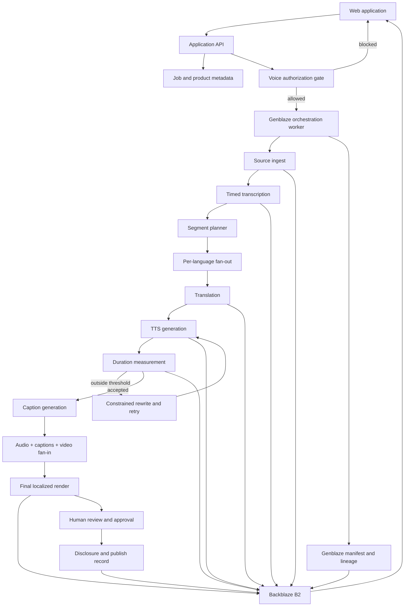

# Toluva — Product, Architecture, and Win Plan

Last updated: July 29, 2026  
Status: Product scaffold and core pipeline foundation complete; live provider spike next
Submission deadline: August 3, 2026 at 10:00 p.m. WAT  
Internal submission target: August 3, 2026 at 6:00 p.m. WAT

## 1. Executive Summary

Toluva is a governed video-localization workflow for enterprise training and
communications teams.

It turns one approved source video into multiple localized editions while:

- Enforcing synthetic-voice authorization
- Measuring and correcting timing drift
- Preserving a complete generation and approval lineage
- Storing source, intermediate, and final assets durably in Backblaze B2
- Using Genblaze for meaningful multi-step generative-media orchestration

The product promise:

> One video. Multiple languages. Every voice authorized, every segment
> time-fit, and every output verifiable.

The short value statement:

> Localize the message without losing control of the voice.

## 2. Why This Can Win

### The audience explains itself

The initial benefit is immediately understandable:

> Turn one approved video into multiple language editions.

The primary audience is enterprise training and communications teams that reuse
videos featuring executives, instructors, brand representatives, or subject
matter experts.

Their practical problems include:

- Localization cost and turnaround time
- Translated speech no longer fitting the source timing
- Inconsistent terminology across regions
- Unclear authorization to clone or synthesize a speaker's voice
- No reliable record of who approved a generated edition
- Difficulty updating many language versions after the source changes
- Fragmented source files, intermediate files, captions, and final exports

### The pipeline complexity is intrinsic

The workflow genuinely needs multiple stages and modalities:

```text
ingest → transcribe → segment → translate → synthesize speech
       → measure → rewrite/retry → caption → compose → approve → publish
```

The composite stage naturally fans in the source video, localized audio,
captions, disclosure data, and other media. Genblaze features should arise from
the workflow rather than being added to satisfy a checklist.

### The B2 storage story is real

A single source produces:

- One source master
- Consent and policy records
- A transcript and timed segments
- Per-language translation revisions
- Multiple TTS attempts
- Caption files
- Audio stems
- Optional posters/thumbnails
- Final localized renders
- Provenance manifests
- Approval/disclosure records

This is a real media-asset lifecycle and a natural object-storage workload.

### The demo is immediately legible

The same clip played across languages is visually and audibly understandable.
The timing QA dashboard and consent-blocked generation create two memorable
product moments that do not require judges to understand the implementation.

## 3. Strategic Differentiation

Generic AI dubbing is a predictable hackathon category. Toluva must win through
domain-specific execution rather than pretending the category is novel.

The differentiation is not “we translate video.” It is:

1. Voice authorization is enforced before generation.
2. Timing fit is measured and corrected segment by segment.
3. Every attempt, decision, and output has inspectable lineage.
4. B2 is used as the durable system of record for the complete media lifecycle.

### Signature demo moment A: timing correction

A translated German segment is 24% longer than its source window. The segment is
red. Toluva requests a semantically equivalent shorter translation, regenerates
the speech, remeasures it, and turns the segment green while preserving the
protected term.

### Signature demo moment B: authorization enforcement

A user requests a Japanese cloned-voice edition, but the consent record covers
only French and Spanish. Toluva blocks the job, shows the exact policy mismatch,
and does not call the billable provider.

The final demo languages are not yet locked. These examples are provisional
until the provider spike verifies API access, voice quality, and language
support.

## 4. Judging Strategy

### Real-world utility

Evidence Toluva should present:

- A specific buyer/user: enterprise training and communications teams
- A concrete source-to-localized-output workflow
- Measurable timing-fit results
- Protected terminology
- Authorization enforcement
- A source-change/versioning story
- A credible reduction in manual coordination

Avoid vague claims about “revolutionizing content.”

### Production readiness

Evidence Toluva should present:

- Explicit job and segment states
- Bounded retries and provider fallback
- Idempotent job creation
- Refresh-safe progress
- Human approval
- Error recovery
- Cost awareness
- Consent validity checks
- Durable versions and audit history
- Stable hosted application and judge access

### B2 storage and data orchestration

Evidence Toluva should present:

- An inspectable asset tree for each project/run/language
- Source, intermediate, final, and manifest objects
- Durable media URLs or secure signed access
- Versioning and lineage
- Hash verification
- Metadata that connects UI records to B2 objects
- No “B2 only stores the final MP4” architecture

### Meaningful Genblaze usage

Evidence Toluva should present:

- A real multi-step pipeline
- Per-language fan-out
- Composite fan-in
- Provider abstraction
- Retry/fallback behavior
- Parent/child lineage for timing correction
- Object storage sink
- Provenance manifests and hashes

The architecture view in the application should make Genblaze's role
understandable without exposing code.

## 5. Synthetic-Voice Angle

### Product role

Provenance must be the product's spine, not a final verification tab.

Before generating a cloned voice, Toluva checks an authorization record:

- Speaker/rights holder
- Voice profile ID
- Voice type: stock, designed, or cloned
- Evidence object and SHA-256
- Permitted languages
- Permitted purposes
- Valid-from and expiry dates
- Revocation state
- Approver and approval timestamp

Example purposes:

- Internal training
- Public marketing
- Customer education
- Product documentation

A request outside this scope is blocked before any paid model call.

### Output disclosure

An applicable localized output should include:

- A clear visible or audible disclosure appropriate to the media
- A machine-readable sidecar or embedded manifest
- The generation provider and model
- Whether a cloned or synthetic stock voice was used
- The applicable consent-record reference
- A cryptographic hash for the output
- The approval state and approving user

### Regulatory context

Article 50 of the EU AI Act becomes applicable on August 2, 2026. It introduces
transparency obligations for certain AI-generated or manipulated content,
including machine-readable marking by applicable providers and disclosure for
certain deepfakes by deployers.

This timing strengthens the problem story, but Toluva must not claim automatic
or guaranteed legal compliance. The safe positioning is:

> Toluva provides an evidence-ready workflow that helps teams document voice
> authorization, generation lineage, integrity, and synthetic-content
> disclosure.

Legal applicability depends on the organization, content, role, deployment,
jurisdiction, exceptions, and the final implementation.

## 6. Timing-Drift QA

### Why it matters

Translations vary in spoken duration. An accurate translation can still create
a bad dub when speech overruns the speaker's visual turn or the next scene.

Timing fit is a domain-specific, objective QA signal:

```text
slot_seconds = source_end_seconds - source_start_seconds
drift_seconds = generated_seconds - slot_seconds
drift_ratio = drift_seconds / slot_seconds
```

### Initial thresholds

```text
GREEN  abs(drift_ratio) <= 0.08
AMBER  0.08 < abs(drift_ratio) <= 0.15
RED    abs(drift_ratio) > 0.15
```

These are product defaults, not universal localization standards. They must be
configurable and tested against the selected sample.

### Correction policy

For overlong speech:

1. Preserve the original meaning and required terminology.
2. Generate a first translation.
3. Generate TTS through the configured Genblaze provider.
4. Measure the returned media with a trusted media-inspection tool.
5. If over threshold, request a shorter translation with:
   - Current duration
   - Target duration
   - Protected terms
   - Meaning constraints
   - Retry number
6. Regenerate and remeasure.
7. Stop after the configured maximum attempts.
8. Permit only a small tempo correction inside an approved range.
9. Otherwise mark the segment “human review required.”

For speech that is too short:

- Prefer natural silence padding for small gaps.
- Optionally request a modest expansion when it improves meaning or flow.
- Avoid unnatural slowing.

### Initial safeguards

- Default maximum rewrite/TTS attempts: 2 after the first attempt.
- Default tempo adjustment limit: to be verified through listening tests; do not
  ship an untested value.
- Protected terms must remain exact or use an approved localized equivalent.
- Every attempt receives its own asset, measurement, status, and lineage.
- A retry must never overwrite the previous attempt in B2.
- The UI must explain why the selected attempt won.

### QA metrics shown in the product

- Source slot duration
- Generated speech duration
- Absolute drift in seconds
- Drift percentage
- Attempt count
- Rewrite reason
- Protected-term result
- Selected/final attempt
- Human approval state

## 7. Important Architecture Decision

Do not use ElevenLabs' one-call Dubbing API as Toluva's core workflow.

Although convenient, it would move transcription, translation, timing, voice,
and composition behind a single external API. That would:

- Hide the main product logic
- Prevent Toluva from owning the timing-correction loop
- Weaken the meaningful Genblaze orchestration story
- Reduce per-stage provenance and inspectability
- Make B2 intermediate-asset orchestration less compelling

Use lower-level capabilities so Toluva owns the workflow:

```text
Transcription
  → timed segmentation
  → translation
  → TTS
  → measured duration
  → bounded rewrite/regeneration
  → captions
  → composition
  → approval/disclosure
```

Genblaze should orchestrate the generative-media portions, store generated
assets through its B2/S3 sink, and preserve lineage/manifests. Where a step is
implemented outside Genblaze, document the reason and attach its inputs and
outputs to the same job/run model.

## 8. Proposed System Architecture



### Components

The exact framework will be chosen during scaffolding, but the responsibilities
are fixed:

- Web UI: upload, configuration, progress, QA timeline, comparison, provenance
- Application API: projects, authorizations, jobs, access, signed asset URLs
- Worker: long-running pipeline jobs, provider polling, retries, composition
- Metadata store: queryable product/job state
- Backblaze B2: durable object and manifest system of record
- Genblaze: generative-media orchestration, provider adapters, storage sink,
  lineage, and provenance
- Media tooling: duration inspection and final composition

Do not rely on an in-memory job queue for the hosted judging path.

## 9. Initial Domain Model

### Project

- `id`
- `name`
- `owner_id`
- `source_asset_id`
- `source_language`
- `created_at`
- `status`

### Speaker

- `id`
- `display_name`
- `voice_profile_id`
- `voice_type`

### VoiceAuthorization

- `id`
- `speaker_id`
- `evidence_asset_id`
- `evidence_sha256`
- `allowed_languages`
- `allowed_purposes`
- `valid_from`
- `expires_at`
- `revoked_at`
- `approved_by`
- `approved_at`

### LocalizationJob

- `id`
- `project_id`
- `target_language`
- `purpose`
- `authorization_id`
- `status`
- `provider`
- `model`
- `estimated_cost`
- `actual_cost`
- `genblaze_run_id`
- `created_at`
- `completed_at`

### Segment

- `id`
- `job_id`
- `source_index`
- `source_start_seconds`
- `source_end_seconds`
- `source_text`
- `protected_terms`
- `status`

### SegmentAttempt

- `id`
- `segment_id`
- `attempt_number`
- `translated_text`
- `audio_asset_id`
- `audio_duration_seconds`
- `drift_seconds`
- `drift_ratio`
- `decision`
- `parent_run_id`
- `genblaze_run_id`

### Asset

- `id`
- `project_id`
- `job_id`
- `segment_id`
- `kind`
- `b2_key`
- `mime_type`
- `size_bytes`
- `sha256`
- `genblaze_manifest_key`
- `created_at`

### Approval

- `id`
- `job_id`
- `status`
- `reviewer`
- `notes`
- `approved_at`

## 10. Proposed B2 Object Layout

Use opaque IDs for privacy and stable organization. A readable draft:

```text
projects/{project_id}/
  source/
    master/{asset_id}.{ext}
    transcript/{version}.json
    segments/{version}.json
  authorizations/
    {authorization_id}/evidence/{asset_id}.{ext}
    {authorization_id}/record.json
  jobs/{job_id}/
    {language}/
      translations/{segment_id}/attempt-{n}.json
      speech/{segment_id}/attempt-{n}.{ext}
      captions/{version}.vtt
      composition/intermediate/{asset_id}.{ext}
      final/{version}.mp4
      disclosure/{version}.json
      manifests/{run_id}.json
  thumbnails/{asset_id}.{ext}
```

Requirements:

- Never overwrite attempts.
- Connect every database asset row to one B2 object.
- Preserve SHA-256 values.
- Keep sensitive consent evidence private.
- Use signed, expiring access for protected media.
- Keep judge demo access simple without exposing the entire bucket.

## 11. TTS Facts and Cost Plan

Verified planning facts as of July 28–29, 2026:

- ElevenLabs states that API access is included on every plan, including Free.
- Free provides 10,000 shared credits.
- Starter is currently listed at $6/month with 30,000 credits and instant voice
  cloning.
- Creator is listed at $22/month with 121,000 credits; a promotional first-month
  discount was displayed at the time of planning.
- Multilingual v2 uses approximately one credit per generated character.
- Flash/Turbo API generation may use approximately 0.5–1 credit per character.
- The same credit pool is shared across ElevenLabs products.
- Free-tier Voice Library API access is restricted.
- The Genblaze v0.6.0 release includes timestamped ElevenLabs TTS compatibility
  improvements.

Working estimate:

- A three-minute source may contain roughly 2,300–2,700 characters.
- Five generated language tracks may require roughly 11,500–13,500 characters
  before retries.
- At one credit per character, a single complete run can exceed the free tier.
- At discounted Flash rates, one run may fit, but retries and other product usage
  make the free tier unsafe as the only plan.

Cost strategy:

1. Verify the exact API route and model on day one.
2. Use 15–30-second clips during development.
3. Cache immutable generated results in B2.
4. Mock providers in automated tests.
5. Use idempotency controls to avoid accidental duplicate billing.
6. Limit retries by segment and job.
7. Track approximate credit consumption.
8. Purchase only after the integration spike confirms the required voice,
   language, cloning, and timestamp features.
9. Reserve full multi-language generations for final QA and demo recording.

The paid-plan decision belongs in the Decision Log after the provider spike.

## 12. Language Strategy

The marketing phrase “one video, five languages” is attractive but must not
become an unsupported technical promise.

Before locking the demo languages, test:

- Provider and model support
- API access on the selected plan
- Voice availability through the API
- Pronunciation quality
- Timestamp behavior
- Generated duration
- Character/credit usage
- Retry quality
- Caption rendering

The final demo may mean either:

- Source English plus four localized outputs, or
- Five localized outputs in addition to the source.

Choose the interpretation only after the cost and quality spike. The demo script
must state it unambiguously.

Language selection principles:

- Include at least one expansion-prone language to demonstrate timing QA.
- Include languages with verified voice quality.
- Favor a smaller number of excellent completed outputs over five broken ones.
- Never advertise unsupported languages because they look globally impressive.

## 13. MVP User Journey

### Step 1: Open a project

The judge opens a preloaded, entrant-owned sample project. Optional upload is
available, but the sample guarantees an immediate experience.

### Step 2: Review voice authorization

The application shows:

- Speaker
- Voice type
- Approved languages
- Approved purpose
- Validity period
- Evidence hash

### Step 3: Configure localization

The user selects:

- Target languages
- Purpose
- Voice
- Protected terminology
- Timing tolerance

### Step 4: Run the pipeline

The application shows clear stages and per-language progress. It exposes
meaningful provider/run details in an inspector.

### Step 5: Inspect timing QA

A timeline shows source slots and generated durations. At least one seeded or
real segment demonstrates the retry loop.

### Step 6: Compare outputs

The user can play:

- Original
- First TTS attempt
- Corrected/final localized result

### Step 7: Approve and verify

The user sees:

- Authorization decision
- Provider and model
- Attempts and drift values
- B2-backed assets
- Manifest/hash verification
- Disclosure status
- Final approval

## 14. MVP Scope

### Must have

- [ ] Stable hosted web application
- [ ] Preloaded judge-friendly sample
- [ ] Source-video upload or ingest
- [ ] B2 source storage
- [ ] Timed transcription
- [ ] Segmentation
- [ ] Voice-authorization record
- [ ] Pre-generation authorization gate
- [ ] Target-language selection
- [ ] Protected terminology
- [ ] Translation
- [ ] Genblaze TTS generation
- [ ] Actual duration measurement
- [ ] Drift classification
- [ ] Bounded rewrite/regeneration loop
- [ ] Captions
- [ ] Final media composition
- [ ] B2 storage for intermediates and finals
- [ ] Genblaze manifests/lineage
- [ ] Job and segment status UI
- [ ] Source/final playback comparison
- [ ] Provenance/disclosure inspector
- [ ] Human approval state
- [ ] Judge access without setup friction

### Should have

- [ ] Provider fallback for TTS
- [ ] Signed private-asset URLs
- [ ] Cost estimate and actual-use display
- [ ] Source-change/version story
- [ ] Downloadable disclosure/manifest bundle
- [ ] Search/filter across localized assets
- [ ] Thumbnail/poster generation if it strengthens the demo

### Explicitly out of scope until must-haves work

- [ ] Perfect lip sync
- [ ] Real-time dubbing
- [ ] General video editing
- [ ] Billing and subscriptions
- [ ] Native mobile apps
- [ ] Voice marketplace
- [ ] Complex team permissions
- [ ] Unlimited providers or languages

## 15. First Technical Spike

Complete before polishing the UI:

1. Install and pin the current Genblaze packages.
2. Create a small B2 test bucket and least-privilege application key.
3. Upload a short entrant-owned source clip.
4. Produce or load a timed transcript.
5. Run one translated TTS segment through the Genblaze ElevenLabs adapter.
6. Confirm the selected voice is available through the actual API plan.
7. Confirm target-language quality.
8. Confirm timestamped response behavior where needed.
9. Measure generated duration independently.
10. Store the asset and Genblaze manifest in B2.
11. Verify the asset hash and manifest.
12. Repeat with a constrained shorter translation.
13. Record actual credit usage.
14. Test one failure and retry path.

Exit criteria:

- One real segment completes end to end.
- B2 contains both TTS attempts and manifests.
- The drift calculation selects the better attempt.
- Cost and language feasibility are known.
- Any Genblaze SDK issue is documented for a useful feedback submission.

### Spike progress — July 29

Completed without provider credentials:

- Installed and pinned the current compatible PyPI packages:
  `genblaze-core==0.3.8`, `genblaze-s3==0.3.6`, and
  `genblaze-elevenlabs==0.3.3`.
- Confirmed Genblaze's current `PipelineResult` interface, manifest schema 1.5,
  strict manifest verification, ElevenLabs timestamp option, and Backblaze
  storage-sink interface.
- Verified `ffmpeg` and `ffprobe` are installed.
- Implemented the pre-generation authorization gate with tests for allowed,
  expired, revoked, wrong-language, wrong-purpose, wrong-voice, invalid
  evidence, and missing-authorization cases.
- Implemented timing measurement and bounded decisions with threshold-boundary
  tests.
- Implemented append-only B2 object keys and a scoped hierarchical Genblaze
  sink. Bucket-wide lifecycle mutation is explicitly disabled.
- Ran a zero-cost Genblaze pipeline against deterministic local audio, wrote a
  canonical manifest, verified the manifest, and independently matched the
  declared asset SHA-256 to the referenced file bytes.
- Added a FastAPI service boundary and secret-safe readiness endpoint.
- Locked the Python dependency graph and passed 35 service tests.

Live portion still required:

- The environment does not currently contain `B2_KEY_ID`, `B2_APP_KEY`,
  `B2_BUCKET`, `B2_REGION`, or `ELEVENLABS_API_KEY`.
- Therefore no B2 object was written and no ElevenLabs credits were spent in
  this phase.
- Once those credentials are injected privately, run the 15–30-second live
  segment path before choosing a paid plan, voice, or final demo languages.

## 16. Delivery Schedule

### July 29 — Lock and spike

- Finalize product documents
- Scaffold the application
- Choose frameworks and deployment target
- Verify Genblaze, B2, transcription, translation, TTS, and media tooling
- Complete one end-to-end segment
- Decide TTS plan and initial demo languages

### July 30 — End-to-end vertical slice

- Persist project/job/asset records
- Implement authorization gate
- Implement per-language pipeline
- Implement timing measurement and bounded retry
- Generate captions
- Compose one complete localized video

### July 31 — Product experience

- Build upload/sample journey
- Build job progress and segment timeline
- Build drift comparison
- Build authorization and provenance inspectors
- Add source/final playback
- Improve errors and refresh recovery

### August 1 — Reliability and deployment

- Deploy the public app
- Add or verify persistent worker/job execution
- Test B2 permissions and signed access
- Add fallback/error states
- Run clean-browser and clean-environment tests
- Freeze dependency versions

### August 2 — Submission assets

- Complete final multi-language sample
- Record the demo video
- Capture screenshots
- Finish README and architecture explanation
- Draft Devpost submission
- File high-quality Genblaze feedback
- Remove unlicensed or unsafe assets

### August 3 — Buffer and submit

- Fix only submission-blocking defects
- Verify hosted app and all links
- Verify judge instructions
- Verify repository access/setup
- Submit by 6:00 p.m. WAT
- Preserve remaining time for emergency correction only

## 17. Three-Minute Demo Storyboard

Target runtime: 2:40–2:55.

### 0:00–0:15 — Problem

“Companies can translate a script quickly, but safely publishing an executive's
synthetic voice in multiple languages requires authorization, timing control,
and a reliable audit trail.”

### 0:15–0:35 — Product promise

Open the prepared project. Show the approved source, voice authorization,
languages, purpose, and protected terminology.

### 0:35–0:55 — Authorization block

Select an unauthorized language or purpose. Show Toluva block the job before
generation. Correct the selection.

### 0:55–1:30 — Pipeline

Start or replay the prepared run. Show Genblaze stages, per-language fan-out,
B2-backed assets, and progress.

### 1:30–2:00 — Timing correction

Open the red overlong segment. Compare first and corrected translations, play
both audio attempts, and show the measured drift turn green.

### 2:00–2:25 — Final output

Play short portions of the source and localized editions.

### 2:25–2:45 — Provenance and storage

Show consent reference, provider/model, parent/child attempts, B2 asset tree,
manifest, SHA-256 verification, and disclosure state.

### 2:45–2:55 — Close

“Toluva localizes the message without losing control of the voice.”

Avoid:

- Long team introductions
- Code walkthroughs
- Waiting on real generation
- Reading architecture slides
- Claims of guaranteed legal compliance
- More than ten seconds of dead loading time

## 18. Submission Checklist

### Application

- [ ] Public URL works in an incognito browser
- [ ] No authentication, or a tested judge account with clear instructions
- [ ] Sample project loads immediately
- [ ] Media plays without private-cookie dependencies
- [ ] No secrets reach the browser
- [ ] Job state survives refresh
- [ ] App remains hosted through August 11

### Repository

- [ ] All necessary source code is present
- [ ] README explains setup from a clean environment
- [ ] Architecture diagram is included
- [ ] Exact providers and models are listed
- [ ] Genblaze usage is explicit
- [ ] B2 usage is explicit
- [ ] Environment variables are documented without values
- [ ] Licenses and attributions are correct
- [ ] Private repo, if used, grants the required Backblaze review account access

### Demo video

- [ ] Under three minutes
- [ ] Publicly visible on YouTube, Vimeo, or Youku
- [ ] Shows the functioning application
- [ ] Includes authorization block
- [ ] Includes timing correction
- [ ] Includes localized output
- [ ] Includes Genblaze and B2 evidence
- [ ] Uses only entrant-owned or licensed media/music/trademarks
- [ ] Captions are readable

### Devpost text

- [ ] Defines the audience and problem immediately
- [ ] Explains the two differentiators
- [ ] Maps features to all four judging criteria
- [ ] Lists providers and exact models
- [ ] Describes B2 object/data orchestration
- [ ] Describes Genblaze pipeline, retries, lineage, and manifests
- [ ] Provides test instructions
- [ ] Does not overclaim compliance or language support

### Feedback Prize

- [ ] File a useful Genblaze GitHub issue
- [ ] Include reproducible details
- [ ] Explain practical impact
- [ ] Propose a viable improvement
- [ ] Link the issue in the submission if appropriate

## 19. Risks and Mitigations

### Competitors build similar dubbing tools

Mitigation: lead with authorization enforcement and objective timing QA. Show
depth rather than provider count.

### TTS quota is exhausted

Mitigation: short development clips, immutable B2 cache, idempotency, bounded
retries, cost tracking, and a paid-plan decision after the spike.

### API plan does not expose the desired voice

Mitigation: verify with the actual API key on day one. Keep a tested stock/design
voice path and do not promise cloning until verified.

### Language quality is poor

Mitigation: choose demo languages only after listening tests. Reduce the
language count before accepting visibly poor output.

### Composition is unstable

Mitigation: establish one deterministic media-composition path early. Use fixed
sample formats and normalize inputs.

### Long-running jobs fail on the hosting platform

Mitigation: use a persistent worker or queue, finite polling, stored state, and
resume/inspect behavior. Do not tie full generation to one browser request.

### Provenance looks bolted on

Mitigation: make authorization a precondition and store every QA attempt. Show
lineage throughout the main workflow.

### Compliance claim creates credibility risk

Mitigation: use evidence-ready/compliance-supporting language, explain limits,
and avoid legal conclusions.

### Demo depends on live providers

Mitigation: prepare a clearly labelled completed sample project while retaining
a small real provider smoke path. Never misrepresent cached assets as a new run.

### Scope consumes the remaining time

Mitigation: enforce the must-have list. Remove languages and secondary features
before compromising the core vertical slice.

## 20. Open Decisions

Resolve during scaffolding or the first spike:

- [x] Web framework — Next.js 16 UI compiled by Vinext for Cloudflare/Sites
- [x] API framework — Python 3.12 with FastAPI
- [ ] Metadata database
- [ ] Job queue/worker approach
- [ ] Worker hosting target; web hosting is locked to OpenAI Sites
- [ ] Transcription provider/model
- [ ] Translation provider/model
- [ ] Primary TTS provider/model
- [ ] Fallback TTS provider/model
- [ ] Voice type used in the demo
- [ ] Paid TTS plan
- [ ] Final target languages
- [ ] Source sample and rights
- [x] Media composition implementation — FFmpeg/ffprobe foundation; final
      composition command still requires the live sample
- [ ] Exact tempo-adjustment limit
- [ ] Visible disclosure format
- [x] Manifest strategy — canonical sidecar is required first; embedding may be
      added only after final-container compatibility testing
- [ ] Authentication versus public judge-demo mode

## 21. Decision Log

### 2026-07-29 — Project name

Decision: The project is named Toluva.

### 2026-07-29 — Primary audience

Decision: Focus on enterprise training and communications teams localizing
videos featuring identifiable speakers.

Reason: This audience makes voice authorization, terminology, approval, timing,
and auditability genuinely important.

### 2026-07-29 — Core differentiators

Decision: Consent-bound voice provenance and timing-drift QA are the two
signature features.

Reason: They distinguish Toluva from generic AI dubbing tools and create
objective, judge-visible product depth.

### 2026-07-29 — Dubbing architecture

Decision: Do not use a one-call third-party dubbing API as the core workflow.

Reason: Toluva must own the translation, TTS, measurement, retry, and composition
stages so Genblaze orchestration and B2 data lifecycle are meaningful.

### 2026-07-29 — Compliance positioning

Decision: Use “evidence-ready” and “compliance-supporting”; do not claim
guaranteed AI Act or other legal compliance.

Reason: The product can preserve useful authorization and provenance evidence,
but legal applicability is context-dependent.

### 2026-07-29 — Web and pipeline execution boundary

Decision: Keep the Sites-hosted Next.js/Vinext experience separate from a
Python 3.12 FastAPI pipeline service.

Reason: Genblaze and long-running media work belong in a durable Python worker,
not in the browser or a short-lived web request. This boundary also guarantees
that B2 and provider credentials never reach client code.

### 2026-07-29 — Initial Genblaze package pins

Decision: Pin the first verified package set to `genblaze-core==0.3.8`,
`genblaze-s3==0.3.6`, and `genblaze-elevenlabs==0.3.3`.

Reason: These are the compatible versions resolved from PyPI and exercised by
the local provenance test. Revisit only through an explicit upgrade spike.

### 2026-07-29 — B2 sink safety and naming

Decision: Use `B2_REGION` with Genblaze's Backblaze factory, hierarchical keys
scoped below the project/job/language, and `auto_lifecycle=False`.

Reason: The current adapter derives the S3 endpoint from the region.
Human-inspectable prefixes strengthen the demo and audit story, while disabling
automatic lifecycle changes prevents an integration test from mutating
bucket-wide policy.

### 2026-07-29 — Provenance verification contract

Decision: Treat Genblaze manifest verification and asset-byte verification as
two separate required checks.

Reason: `Manifest.verify()` validates canonical integrity and declared output
hash metadata; it does not fetch a remote asset and recompute its bytes. Toluva
must compare the stored object's bytes to the declared SHA-256 before calling
an asset verified.

### 2026-07-29 — Initial manifest delivery

Decision: Preserve a canonical Genblaze manifest sidecar for every output.
Container embedding remains optional until compatibility is tested against the
final MP4 path.

Reason: A sidecar is inspectable, storage-friendly, and sufficient for the
first auditable vertical slice without risking media-container regressions.

## 22. Official References

Hackathon:

- Overview and requirements:
  https://backblaze-generative-media.devpost.com/
- Official rules, dates, submission requirements, and judging:
  https://backblaze-generative-media.devpost.com/rules
- Resources:
  https://backblaze-generative-media.devpost.com/resources
- Organizer updates:
  https://backblaze-generative-media.devpost.com/updates
- Genblaze repository:
  https://github.com/backblaze-labs/genblaze
- Organizer multi-provider starter app:
  https://backblaze-generative-media.devpost.com/updates/45182-genblaze-multi-provider-starter-app

ElevenLabs:

- Current pricing:
  https://elevenlabs.io/pricing
- TTS documentation and language/model information:
  https://elevenlabs.io/docs/overview/capabilities/text-to-speech
- Official API-plan answer:
  https://help.elevenlabs.io/hc/en-us/articles/28184926326033-How-much-does-it-cost-to-use-the-API

EU AI Act transparency context:

- European Commission Article 50 guidance:
  https://digital-strategy.ec.europa.eu/en/policies/guidelines-transparency-ai-generated-content
- European Commission transparency quick facts:
  https://digital-strategy.ec.europa.eu/en/factpages/quick-facts-transparency-rules-ai-systems
- Official regulation:
  https://eur-lex.europa.eu/eli/reg/2024/1689/oj
